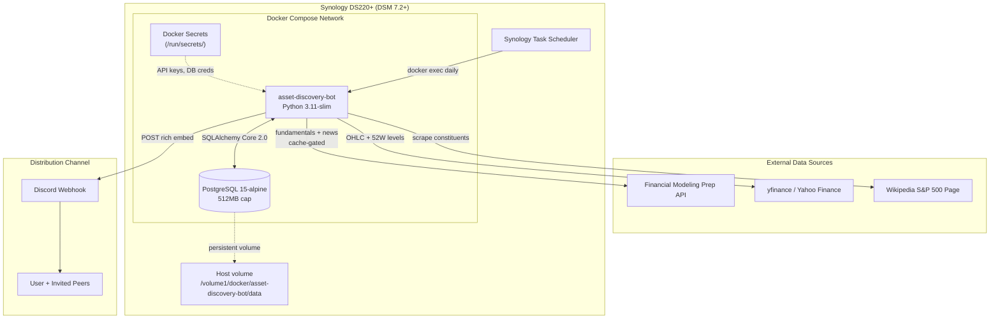
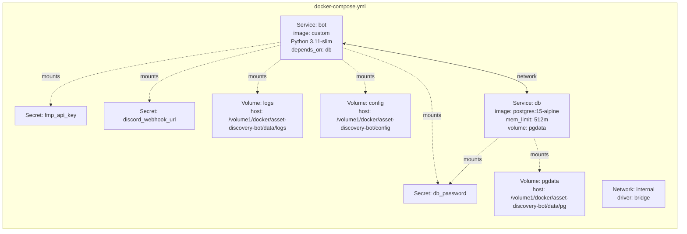
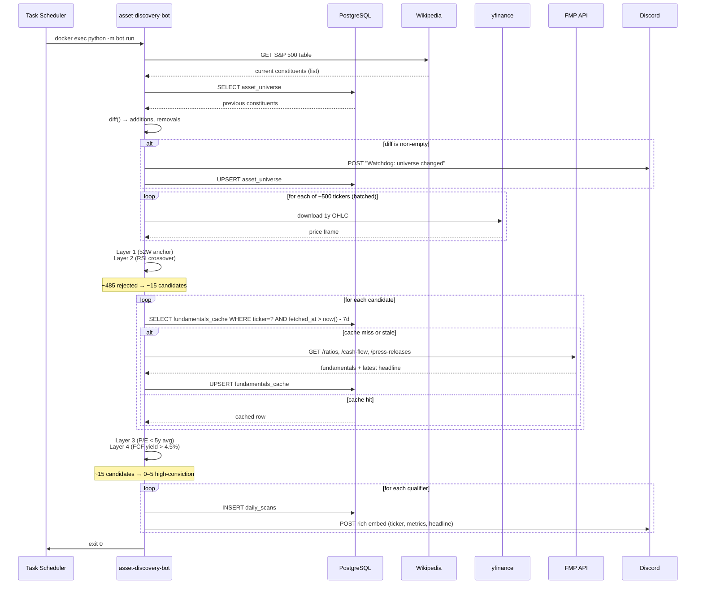
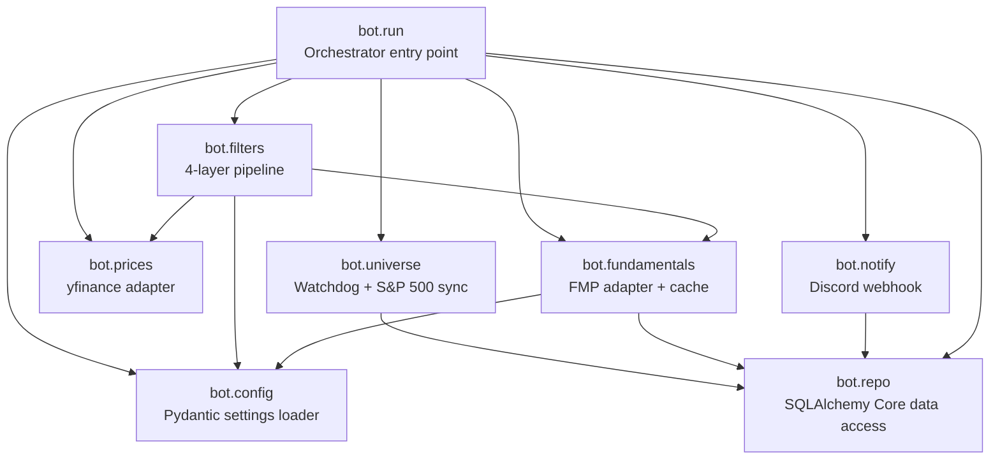
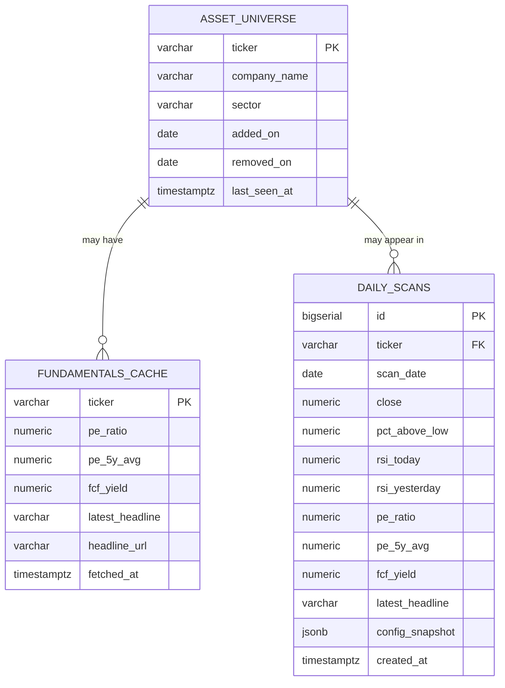

# Design Document: Asset Discovery Bot

## Overview

The Asset Discovery Bot is a systematic, emotionless investment **research tool** that scans the S&P 500 universe daily to surface equities exhibiting a combined value-and-quality pattern with early signs of price recovery. It applies a sequential 4-layer "tollbooth" filter inspired by three academic frameworks: the Fama-French 5-Factor model (value + profitability factor tilts), the George & Hwang (2004) 52-Week Low Anomaly (psychological anchoring), and the Asness et al. "Quality Minus Junk" factor (avoiding value traps). The bot runs as a lightweight containerized workload on a Synology DS220+ NAS, caches fundamentals in PostgreSQL to stay within free API tiers, and pushes alerts to Discord via webhooks.

**Scope discipline (v1):** This is a *v1 — alert and research mode*, not a capital deployment system. Signals are logged and surfaced to Discord for human review. The user is expected to **paper-trade** this strategy for at least 6–12 months before committing capital, and to compare realized performance against a factor-tilted ETF benchmark (e.g., AVUV, IWD, RPV). Known limitations and the deferred-work roadmap to a serious factor screener are captured in the **Known Limitations and Risks** and **v2 Roadmap** sections below.

The design is optimized for a constrained deployment environment (2 GB RAM host, 512 MB Postgres cap) and zero-cost operation (hybrid data sourcing: yfinance for unlimited OHLC + Financial Modeling Prep for deep fundamentals, gated by cache). A "Just-In-Time" data flow minimizes API pressure: technical filters aggressively prune the universe down to ~15 candidates before any fundamental API call is made. A separate Watchdog process cross-references the live Wikipedia S&P 500 list against the local `asset_universe` table to detect index additions and removals.

This document combines High-Level Design (architecture diagrams, container topology, component contracts, ER model) with Low-Level Design (pseudocode for each filter layer, function signatures, SQL DDL, Discord webhook contract, caching logic).

## Architecture

### System Context



### Container Topology



**Resource profile:**
- Python container: ~150 MB RAM steady, ~300 MB peak during Pandas calculations
- Postgres container: hard-capped at 512 MB via `mem_limit`
- Total headroom: leaves ~1.2 GB on a DS220+ for DSM + other services

### End-to-End Data Flow (Just-In-Time)



## Components and Interfaces

The application is organized into six cohesive modules under a `bot/` package. Each module has a single responsibility and a narrow public surface.



### Component 1: `bot.universe` — The Watchdog

**Purpose**: Maintain the authoritative S&P 500 ticker list and detect additions/removals.

**Responsibilities:**
- Scrape the current S&P 500 table from Wikipedia
- Diff against `asset_universe` and produce `{added: [...], removed: [...]}`
- Upsert the canonical universe
- Emit a "Yellow" Discord alert on any membership change

**Public interface:**

```python
from dataclasses import dataclass
from datetime import date

@dataclass(frozen=True)
class UniverseDiff:
    added: list[str]       # tickers newly in the S&P 500
    removed: list[str]     # tickers dropped from the S&P 500
    as_of: date

def fetch_current_constituents() -> list[str]:
    """Scrape Wikipedia S&P 500 table. Returns sorted unique tickers."""

def sync_universe(repo: "Repository") -> UniverseDiff:
    """Load previous list from DB, fetch current, upsert, return diff."""
```

### Component 2: `bot.prices` — Technical Data Adapter

**Purpose**: Pull OHLC price history from yfinance and compute technical indicators used by Layers 1 & 2.

**Responsibilities:**
- Batch-download 1-year daily OHLC for a list of tickers
- Compute 52-week low, percent-above-low, and RSI(14) for the last two sessions
- Return a tidy Pandas DataFrame keyed by ticker

**Public interface:**

```python
import pandas as pd

def download_price_history(
    tickers: list[str],
    period: str = "1y",
) -> dict[str, pd.DataFrame]:
    """Batch OHLC pull from yfinance. Returns {ticker: frame(Date, Open, High, Low, Close, Volume)}."""

def compute_technical_snapshot(frames: dict[str, pd.DataFrame]) -> pd.DataFrame:
    """
    Vectorized computation of per-ticker technicals.
    Columns: ticker, close, low_52w, pct_above_low, rsi_today, rsi_yesterday
    """
```

### Component 3: `bot.fundamentals` — FMP Adapter + Cache Gateway

**Purpose**: Provide trailing P/E, 5-year average P/E, FCF yield, and the latest press-release headline — but only when the local cache is cold.

**Responsibilities:**
- Check `fundamentals_cache` for a row newer than 7 days
- On miss or stale: call FMP `/ratios`, `/cash-flow-statement`, `/press-releases`
- Derive FCF yield = trailing 12-month FCF / market cap
- Upsert the enriched row and return a typed record

**Public interface:**

```python
from dataclasses import dataclass
from datetime import datetime

@dataclass(frozen=True)
class Fundamentals:
    ticker: str
    pe_ratio: float | None
    pe_5y_avg: float | None
    fcf_yield: float | None
    latest_headline: str | None
    headline_url: str | None
    fetched_at: datetime

def get_fundamentals(
    ticker: str,
    repo: "Repository",
    fmp_client: "FmpClient",
    staleness_days: int = 7,
) -> Fundamentals:
    """Cache-gated fetch. Hits FMP only if cache row is missing or older than staleness_days."""
```

### Component 4: `bot.filters` — The 4-Layer Tollbooth

**Purpose**: Apply the sequential filter pipeline and return the high-conviction set.

**Responsibilities:**
- Layer 1: 52-week anchor (5% ≤ pct_above_low ≤ 15%)
- Layer 2: RSI capitulation crossover (rsi_yesterday < 30 AND rsi_today > 30)
- Layer 3: P/E value (pe_ratio < pe_5y_avg, both non-null)
- Layer 4: FCF quality (fcf_yield > 0.045)
- Return qualifiers with the inputs that justified their inclusion

**Public interface:**

```python
from dataclasses import dataclass

@dataclass(frozen=True)
class ScanCandidate:
    ticker: str
    close: float
    pct_above_low: float
    rsi_today: float
    rsi_yesterday: float
    pe_ratio: float
    pe_5y_avg: float
    fcf_yield: float
    latest_headline: str | None
    headline_url: str | None

def apply_layer_1(snapshot: pd.DataFrame) -> pd.DataFrame: ...
def apply_layer_2(snapshot: pd.DataFrame) -> pd.DataFrame: ...
def apply_layer_3(snapshot: pd.DataFrame) -> pd.DataFrame: ...
def apply_layer_4(snapshot: pd.DataFrame) -> pd.DataFrame: ...

def run_pipeline(
    universe: list[str],
    price_fetcher,
    fundamentals_fetcher,
) -> list[ScanCandidate]:
    """End-to-end: fetch prices, apply L1+L2, enrich survivors, apply L3+L4."""
```

### Component 5: `bot.notify` — Discord Webhook Publisher

**Purpose**: Format and POST alerts to Discord.

**Responsibilities:**
- Render a "High Conviction" rich embed per qualifier (ticker, close, pct_above_low, RSI, P/E, FCF yield, headline)
- Render a "Watchdog" yellow embed on universe diff
- POST to webhook with exponential backoff on 429 / 5xx
- Log successful posts to `daily_scans`

**Public interface:**

```python
def send_high_conviction(candidate: ScanCandidate, webhook_url: str) -> None: ...
def send_watchdog(diff: UniverseDiff, webhook_url: str) -> None: ...
```

### Component 6: `bot.config` — Configuration Loader

**Purpose**: Centralize every tunable parameter (filter thresholds, cache TTLs, retry budgets, log levels) in a single declarative config. Keep secrets in `/run/secrets/*` and tunables in `config.yaml` — separating the two concerns so thresholds can be experimented with freely without touching secret material.

**Responsibilities:**
- Load `config.yaml` from a mounted volume (default: `/app/config/config.yaml`)
- Merge with environment-variable overrides (for quick one-off experiments in `docker-compose` or `docker run -e`)
- Load secrets separately from `/run/secrets/*`
- Validate every field with Pydantic, failing the run immediately on bad values (e.g., negative FCF yield threshold, RSI outside [0, 100])
- Expose a single frozen `AppConfig` object consumed by every other module

**Public interface:**

```python
from pydantic import BaseModel, Field, field_validator
from pathlib import Path

class Layer1Config(BaseModel):
    """52-Week Low Anchor (George & Hwang)."""
    pct_above_low_min: float = Field(0.05, ge=0.0, le=1.0)  # inclusive lower bound
    pct_above_low_max: float = Field(0.15, ge=0.0, le=1.0)  # inclusive upper bound

    @field_validator("pct_above_low_max")
    @classmethod
    def _max_gt_min(cls, v, info):
        if v <= info.data.get("pct_above_low_min", 0.0):
            raise ValueError("pct_above_low_max must exceed pct_above_low_min")
        return v


class Layer2Config(BaseModel):
    """RSI Capitulation Crossover."""
    rsi_period: int = Field(14, ge=2, le=100)
    rsi_oversold: float = Field(30.0, ge=0.0, le=100.0)   # yesterday must be BELOW this
    rsi_recovery: float = Field(30.0, ge=0.0, le=100.0)   # today must be ABOVE this
    # Independent thresholds allow experimenting with a "buffer" like 28 → 32


class Layer3Config(BaseModel):
    """Fama-French Value (HML proxy)."""
    require_positive_earnings: bool = True
    # Future: add pe_ratio_max ceiling, pe_5y_avg_discount_min (e.g., 0.85)


class Layer4Config(BaseModel):
    """Fama-French Quality / QMJ (FCF yield)."""
    fcf_yield_min: float = Field(0.045, ge=0.0, le=1.0)


class CacheConfig(BaseModel):
    fundamentals_staleness_days: int = Field(7, ge=1, le=90)


class UniverseConfig(BaseModel):
    min_constituent_count: int = Field(450, ge=0)  # sanity bound
    max_constituent_count: int = Field(520, ge=0)
    source_url: str = "https://en.wikipedia.org/wiki/List_of_S%26P_500_companies"


class NotificationConfig(BaseModel):
    max_retries: int = Field(5, ge=0, le=20)
    backoff_initial_seconds: float = Field(1.0, ge=0.0)
    backoff_max_seconds: float = Field(60.0, ge=0.0)
    bot_username: str = "Asset Discovery Bot"


class FmpConfig(BaseModel):
    base_url: str = "https://financialmodelingprep.com/api/v3"
    timeout_seconds: float = Field(10.0, ge=1.0)
    max_daily_calls_soft_cap: int = Field(200, ge=0)  # warn at this threshold; FMP free tier is 250


class YFinanceConfig(BaseModel):
    history_period: str = "1y"
    batch_size: int = Field(100, ge=1, le=500)
    retries_per_ticker: int = Field(3, ge=0, le=10)


class LoggingConfig(BaseModel):
    level: str = "INFO"
    log_dir: Path = Path("/var/log/asset-discovery-bot")
    max_file_size_mb: int = Field(10, ge=1)
    backup_count: int = Field(7, ge=0)


class AppConfig(BaseModel):
    """Root configuration. Immutable after load."""
    model_config = {"frozen": True}

    layer1:        Layer1Config        = Layer1Config()
    layer2:        Layer2Config        = Layer2Config()
    layer3:        Layer3Config        = Layer3Config()
    layer4:        Layer4Config        = Layer4Config()
    cache:         CacheConfig         = CacheConfig()
    universe:      UniverseConfig      = UniverseConfig()
    notification:  NotificationConfig  = NotificationConfig()
    fmp:           FmpConfig           = FmpConfig()
    yfinance:      YFinanceConfig      = YFinanceConfig()
    logging:       LoggingConfig       = LoggingConfig()


class Secrets(BaseModel):
    """Loaded from /run/secrets/*. Never logged, never echoed."""
    db_url: str
    fmp_api_key: str
    discord_webhook_url: str


def load_config(
    config_path: Path = Path("/app/config/config.yaml"),
    secrets_dir: Path = Path("/run/secrets"),
) -> tuple[AppConfig, Secrets]:
    """
    Load AppConfig from YAML with env-var overrides, and Secrets from Docker secrets files.
    Raises ValidationError on bad config (fail-fast). Never logs secret values.
    """
```

**Environment-variable override convention:**

Nested fields are flattened with `ADB_` prefix and double-underscore delimiters. Examples:
- `ADB_LAYER1__PCT_ABOVE_LOW_MIN=0.03`
- `ADB_LAYER4__FCF_YIELD_MIN=0.04`
- `ADB_CACHE__FUNDAMENTALS_STALENESS_DAYS=14`

This lets the user run one-off experiments (`docker compose run -e ADB_LAYER1__PCT_ABOVE_LOW_MAX=0.20 bot`) without editing `config.yaml`.

**Example `config.yaml` (all defaults shown explicitly for reference):**

```yaml
# /volume1/docker/asset-discovery-bot/config/config.yaml
layer1:
  pct_above_low_min: 0.05     # 5% above 52W low (inclusive lower bound)
  pct_above_low_max: 0.15     # 15% above 52W low (inclusive upper bound)

layer2:
  rsi_period: 14
  rsi_oversold: 30.0          # yesterday's RSI must be below this
  rsi_recovery: 30.0          # today's RSI must be above this
  # Experiment: set oversold=28, recovery=32 for a stricter crossover

layer3:
  require_positive_earnings: true

layer4:
  fcf_yield_min: 0.045        # 4.5% FCF yield floor

cache:
  fundamentals_staleness_days: 7

universe:
  min_constituent_count: 450
  max_constituent_count: 520
  source_url: "https://en.wikipedia.org/wiki/List_of_S%26P_500_companies"

notification:
  max_retries: 5
  backoff_initial_seconds: 1.0
  backoff_max_seconds: 60.0
  bot_username: "Asset Discovery Bot"

fmp:
  base_url: "https://financialmodelingprep.com/api/v3"
  timeout_seconds: 10.0
  max_daily_calls_soft_cap: 200

yfinance:
  history_period: "1y"
  batch_size: 100
  retries_per_ticker: 3

logging:
  level: "INFO"
  log_dir: "/var/log/asset-discovery-bot"
  max_file_size_mb: 10
  backup_count: 7
```

**Precedence rules (highest wins):**
1. Environment variable (`ADB_*`)
2. `config.yaml` value
3. Pydantic field default

**Change-management workflow:**
1. Edit `config.yaml` on the NAS (or set an env var in `docker-compose.override.yml`)
2. Restart the container — the new values load on next run
3. Every run emits a single log line at INFO listing the active non-default values (never secrets) for auditability
4. The run also records the full config snapshot to `daily_scans.config_snapshot` (see DDL update below) so historical alerts can be reproduced

### Component 7: `bot.repo` — Data Access Layer

**Purpose**: Encapsulate all SQLAlchemy Core 2.0 interactions. No ORM; explicit SQL via `Table` + `select`/`insert`.

**Responsibilities:**
- Own the `Engine` and provide a transactional context manager
- Expose typed methods for each table (`asset_universe`, `fundamentals_cache`, `daily_scans`)
- Enforce upsert semantics via `INSERT ... ON CONFLICT`

**Public interface:**

```python
from contextlib import contextmanager
from sqlalchemy.engine import Engine

class Repository:
    def __init__(self, engine: Engine): ...

    @contextmanager
    def transaction(self): ...

    def load_universe(self) -> set[str]: ...
    def upsert_universe(self, tickers: list[str], as_of: date) -> None: ...

    def load_fundamentals(self, ticker: str) -> Fundamentals | None: ...
    def upsert_fundamentals(self, f: Fundamentals) -> None: ...

    def insert_scan(
        self,
        candidate: ScanCandidate,
        scan_date: date,
        config_snapshot: dict,
    ) -> None: ...
    def recent_scans(self, days: int = 30) -> list[dict]: ...
```

## Data Models

### Entity-Relationship Diagram



### SQL DDL

```sql
-- Extensions (optional, for future use)
CREATE EXTENSION IF NOT EXISTS citext;

-- 1. S&P 500 membership (watchdog source of truth)
CREATE TABLE IF NOT EXISTS asset_universe (
    ticker          VARCHAR(10)  PRIMARY KEY,
    company_name    VARCHAR(255) NOT NULL,
    sector          VARCHAR(64),
    added_on        DATE         NOT NULL DEFAULT CURRENT_DATE,
    removed_on      DATE,                           -- NULL = currently in index
    last_seen_at    TIMESTAMPTZ  NOT NULL DEFAULT NOW()
);
CREATE INDEX IF NOT EXISTS ix_asset_universe_active
    ON asset_universe (ticker) WHERE removed_on IS NULL;

-- 2. Fundamentals cache (gates FMP calls)
CREATE TABLE IF NOT EXISTS fundamentals_cache (
    ticker          VARCHAR(10)  PRIMARY KEY
        REFERENCES asset_universe (ticker) ON UPDATE CASCADE,
    pe_ratio        NUMERIC(12, 4),
    pe_5y_avg       NUMERIC(12, 4),
    fcf_yield       NUMERIC(10, 6),
    latest_headline VARCHAR(512),
    headline_url    VARCHAR(512),
    fetched_at      TIMESTAMPTZ  NOT NULL DEFAULT NOW()
);
CREATE INDEX IF NOT EXISTS ix_fundamentals_cache_fetched
    ON fundamentals_cache (fetched_at);

-- 3. Daily scan history (every high-conviction alert)
CREATE TABLE IF NOT EXISTS daily_scans (
    id              BIGSERIAL    PRIMARY KEY,
    ticker          VARCHAR(10)  NOT NULL
        REFERENCES asset_universe (ticker) ON UPDATE CASCADE,
    scan_date       DATE         NOT NULL,
    close           NUMERIC(12, 4) NOT NULL,
    pct_above_low   NUMERIC(6, 4)  NOT NULL,
    rsi_today       NUMERIC(6, 3)  NOT NULL,
    rsi_yesterday   NUMERIC(6, 3)  NOT NULL,
    pe_ratio        NUMERIC(12, 4) NOT NULL,
    pe_5y_avg       NUMERIC(12, 4) NOT NULL,
    fcf_yield       NUMERIC(10, 6) NOT NULL,
    latest_headline VARCHAR(512),
    config_snapshot JSONB          NOT NULL,       -- exact AppConfig used for this alert
    created_at      TIMESTAMPTZ  NOT NULL DEFAULT NOW(),
    CONSTRAINT uq_scan_per_day UNIQUE (ticker, scan_date)
);
CREATE INDEX IF NOT EXISTS ix_daily_scans_date ON daily_scans (scan_date DESC);
```

**Validation Rules:**
- `pct_above_low` is stored as a decimal fraction (0.05 = 5%).
- `fcf_yield` same (0.045 = 4.5%).
- `uq_scan_per_day` prevents duplicate alerts if the scheduler fires twice in one day.
- `removed_on IS NULL` is the "currently active" predicate — the partial index keeps active-universe lookups cheap.


## Algorithmic Pseudocode

### Orchestrator: Daily Run

```pascal
ALGORITHM runDailyScan(clock)
INPUT:  clock      -- injectable time source (for testability)
OUTPUT: exit code (0 = success, non-zero = failure)

BEGIN
  cfg, secrets ← load_config()                   // AppConfig + Secrets; fails fast on bad values
  LOG f"Config: active non-default values = {cfg.diff_from_defaults()}"   // never logs secrets

  engine ← createEngine(secrets.db_url)
  repo   ← Repository(engine)

  // Phase 1: Watchdog
  diff ← sync_universe(repo, cfg.universe)
  ASSERT diff ≠ NULL
  IF diff.added ≠ ∅ OR diff.removed ≠ ∅ THEN
    send_watchdog(diff, secrets.discord_webhook_url, cfg.notification)
  END IF

  // Phase 2: Load active universe
  universe ← repo.load_universe()                // set of active tickers
  ASSERT |universe| ∈ [cfg.universe.min_constituent_count, cfg.universe.max_constituent_count]

  // Phase 3: Triage (technical layers, pure local compute)
  frames    ← download_price_history(list(universe), cfg.yfinance)
  snapshot  ← compute_technical_snapshot(frames, cfg.layer2.rsi_period)

  layer1_survivors ← apply_layer_1(snapshot,          cfg.layer1)
  layer2_survivors ← apply_layer_2(layer1_survivors,  cfg.layer2)

  LOG f"Triage: {len(universe)} → L1 {len(layer1_survivors)} → L2 {len(layer2_survivors)}"

  // Phase 4: Enrich survivors (cache-gated FMP calls)
  fmp      ← FmpClient(api_key=secrets.fmp_api_key, cfg=cfg.fmp)
  enriched ← []
  FOR each row IN layer2_survivors DO
    f ← get_fundamentals(row.ticker, repo, fmp, cfg.cache.fundamentals_staleness_days)
    IF f.pe_ratio ≠ NULL AND f.pe_5y_avg ≠ NULL AND f.fcf_yield ≠ NULL THEN
      enriched.append(merge(row, f))
    END IF
  END FOR

  // Phase 5: Value + Quality layers
  layer3_survivors ← apply_layer_3(enriched,         cfg.layer3)
  layer4_survivors ← apply_layer_4(layer3_survivors, cfg.layer4)

  LOG f"Deep: {len(layer2_survivors)} → L3 {len(layer3_survivors)} → L4 {len(layer4_survivors)}"

  // Phase 6: Alert + persist
  today           ← clock.today()
  config_snapshot ← cfg.model_dump()              // JSON-serializable; stored with every scan
  FOR each candidate IN layer4_survivors DO
    TRY
      repo.insert_scan(candidate, today, config_snapshot)
      send_high_conviction(candidate, secrets.discord_webhook_url, cfg.notification)
    CATCH UniqueViolation:
      LOG f"Duplicate scan for {candidate.ticker} on {today}, skipping alert"
    END TRY
  END FOR

  RETURN 0
END
```

**Preconditions:**
- `config.yaml` is mounted and parseable; all fields pass Pydantic validation
- `secrets.db_url`, `secrets.fmp_api_key`, `secrets.discord_webhook_url` all loaded from `/run/secrets/*`
- Database migrations have been applied (all three tables exist)
- Network egress to Wikipedia, Yahoo Finance, FMP, and Discord is reachable

**Postconditions:**
- `asset_universe` reflects today's Wikipedia scrape
- Zero or more rows inserted into `daily_scans` for today, each with its `config_snapshot` JSONB
- Zero or more Discord messages posted
- `fundamentals_cache` rows are fresh (< `cfg.cache.fundamentals_staleness_days`) for every L2 survivor that was processed

**Invariants:**
- FMP is never called for a ticker that failed L1 or L2
- No duplicate `(ticker, scan_date)` row exists in `daily_scans`
- A Discord message is sent iff the `daily_scans` insert succeeded (at-least-once semantics; de-dup is via the unique constraint)
- Every emitted alert is paired with the exact `AppConfig` that produced it (reproducibility)

---

### Layer 1: The Anchor Check (George & Hwang, 2004)

**Rationale:** Price within `layer1.pct_above_low_min` and `layer1.pct_above_low_max` above the 52-week low (defaults: 5%–15%). The lower bound avoids "falling knives" still in free-fall; the upper bound ensures the anchor effect is still psychologically salient.

```pascal
ALGORITHM apply_layer_1(snapshot, cfg)
INPUT:  snapshot  -- DataFrame with columns {ticker, close, low_52w, ...}
        cfg       -- Layer1Config
OUTPUT: DataFrame containing only rows that pass the anchor check

BEGIN
  // Vectorized in Pandas; expressed here as per-row logic
  FOR each row IN snapshot DO
    pct ← (row.close - row.low_52w) / row.low_52w
    row.pct_above_low ← pct
    row.passes_l1    ← (cfg.pct_above_low_min ≤ pct ≤ cfg.pct_above_low_max)
  END FOR

  RETURN snapshot WHERE passes_l1 = TRUE
END
```

**Preconditions:**
- `snapshot.low_52w > 0` for all rows (filter out tickers with corrupt history upstream)
- `snapshot.close > 0`
- `cfg.pct_above_low_max > cfg.pct_above_low_min`

**Postconditions:**
- Every returned row has `cfg.pct_above_low_min ≤ pct_above_low ≤ cfg.pct_above_low_max`
- Input DataFrame is not mutated (return a new frame)

---

### Layer 2: The Capitulation Check (Momentum Crossover)

**Rationale:** RSI crossing up through `layer2.rsi_oversold`/`rsi_recovery` (defaults: 30 / 30) identifies the transition from "oversold" to "recovering." A single snapshot of RSI < 30 is ambiguous (could still be falling); the two-day crossover confirms momentum has turned. Independent thresholds allow experimenting with a buffer (e.g., 28 → 32) for a stricter signal.

```pascal
ALGORITHM apply_layer_2(snapshot, cfg)
INPUT:  snapshot  -- must contain {rsi_today, rsi_yesterday}
        cfg       -- Layer2Config
OUTPUT: DataFrame containing only rows where RSI crossed up through the threshold

BEGIN
  FOR each row IN snapshot DO
    row.passes_l2 ← (row.rsi_yesterday < cfg.rsi_oversold)
                  AND (row.rsi_today > cfg.rsi_recovery)
  END FOR

  RETURN snapshot WHERE passes_l2 = TRUE
END


ALGORITHM compute_rsi(close_series, period)
INPUT:  close_series  -- chronologically ordered daily closes
        period        -- from cfg.layer2.rsi_period (default 14)
OUTPUT: rsi_series    -- same length as input, NaN for first `period` entries

BEGIN
  deltas    ← close_series.diff()
  gains     ← max(deltas, 0)
  losses    ← max(-deltas, 0)

  // Wilder's smoothing = exponential moving average with α = 1/period
  avg_gain  ← ewm(gains,  α=1/period).mean()
  avg_loss  ← ewm(losses, α=1/period).mean()

  rs        ← avg_gain / avg_loss
  rsi       ← 100 - (100 / (1 + rs))

  // Handle divide-by-zero: if avg_loss = 0, RSI = 100
  WHERE avg_loss = 0 → rsi = 100

  RETURN rsi
END
```

**Preconditions:**
- `close_series` has at least `period + 1` observations
- All prices are strictly positive

**Postconditions:**
- Every returned RSI value ∈ [0, 100]
- L2 survivors all satisfy: yesterday's RSI was in the oversold zone and today's is not

**Loop Invariants (inside `compute_rsi`):**
- After processing day `i`, `avg_gain[i]` and `avg_loss[i]` incorporate all deltas up to day `i`
- `rsi[i]` depends only on closes up to and including day `i` (no look-ahead)

---

### Layer 3: Margin of Safety (Fama-French Value / HML)

**Rationale:** A stock whose current P/E is below its own 5-year average is historically cheap relative to its own earnings power — isolating the HML factor without requiring cross-sectional book-to-market screening. `layer3.require_positive_earnings` controls whether negative-earnings firms are excluded (default: excluded).

```pascal
ALGORITHM apply_layer_3(enriched, cfg)
INPUT:  enriched  -- rows with {pe_ratio, pe_5y_avg} populated
        cfg       -- Layer3Config
OUTPUT: rows where current P/E < 5-year average P/E

BEGIN
  FOR each row IN enriched DO
    row.passes_l3 ← (row.pe_ratio ≠ NULL)
                  AND (row.pe_5y_avg ≠ NULL)
                  AND (row.pe_ratio < row.pe_5y_avg)

    IF cfg.require_positive_earnings THEN
      row.passes_l3 ← row.passes_l3
                    AND (row.pe_ratio > 0)
                    AND (row.pe_5y_avg > 0)
    END IF
  END FOR

  RETURN enriched WHERE passes_l3 = TRUE
END
```

**Preconditions:**
- Every row has attempted a fundamentals fetch (either cache hit or FMP call)
- NULL P/E is a valid signal (negative or undefined earnings) → row is excluded

**Postconditions:**
- Every survivor has `pe_ratio < pe_5y_avg`
- If `cfg.require_positive_earnings`: both strictly positive

---

### Layer 4: The Junk Filter (Fama-French Quality / RMW + QMJ)

**Rationale:** Low P/E alone is a trap if earnings are manipulated or cash is evaporating. FCF yield above `layer4.fcf_yield_min` (default 4.5%) ensures the "cheapness" is backed by real cash generation — the essence of Asness's Quality Minus Junk.

```pascal
ALGORITHM apply_layer_4(layer3_survivors, cfg)
INPUT:  layer3_survivors
        cfg  -- Layer4Config
OUTPUT: final high-conviction candidates

BEGIN
  FOR each row IN layer3_survivors DO
    row.passes_l4 ← (row.fcf_yield ≠ NULL) AND (row.fcf_yield > cfg.fcf_yield_min)
  END FOR

  RETURN layer3_survivors WHERE passes_l4 = TRUE
END
```

**Preconditions:**
- `fcf_yield` is computed as `ttm_free_cash_flow / market_cap` (see `bot.fundamentals`)
- Market cap is taken from FMP at fetch time, not recomputed

**Postconditions:**
- Every final candidate satisfies ALL four layers simultaneously
- A final candidate is materially down from its highs, showing momentum recovery, historically cheap by its own P/E, and cash-generative

---

### Fundamentals Cache Gate

```pascal
ALGORITHM get_fundamentals(ticker, repo, fmp_client, staleness_days)
INPUT:  ticker, repo, fmp_client, staleness_days
OUTPUT: Fundamentals record (never NULL; may have NULL fields if FMP lacks data)

BEGIN
  cached ← repo.load_fundamentals(ticker)
  now    ← currentTime()

  IF cached ≠ NULL AND (now - cached.fetched_at).days < staleness_days THEN
    RETURN cached                                  // cache hit
  END IF

  // Cache miss or stale → hit FMP (3 endpoints, budgeted)
  ratios       ← fmp_client.get_ratios(ticker)               // pe_ratio, 5y history
  cash_flow    ← fmp_client.get_cash_flow_ttm(ticker)        // FCF (ttm)
  profile      ← fmp_client.get_profile(ticker)              // market cap
  press        ← fmp_client.get_latest_press_release(ticker) // headline + url

  pe_5y_avg    ← mean([r.pe for r IN ratios if r.year ≥ now.year - 5])
  fcf_yield    ← IF profile.market_cap > 0
                    THEN cash_flow.free_cash_flow_ttm / profile.market_cap
                    ELSE NULL

  record ← Fundamentals(
    ticker          = ticker,
    pe_ratio        = ratios[0].pe,
    pe_5y_avg       = pe_5y_avg,
    fcf_yield       = fcf_yield,
    latest_headline = press.title,
    headline_url    = press.url,
    fetched_at      = now
  )

  repo.upsert_fundamentals(record)
  RETURN record
END
```

**Preconditions:**
- `staleness_days > 0`
- FMP API key is loaded from `/run/secrets/fmp_api_key`

**Postconditions:**
- After return, `fundamentals_cache[ticker].fetched_at` ≥ now − staleness_days
- Total FMP call count per run ≤ 3 × (L2 survivors) ≤ 3 × 25 = 75 in practice, well under the 250/day free tier

**FMP Budget Invariant:**
- Daily FMP calls = 3 × |L2 survivors that were cache-miss| + 0 × |L2 survivors that were cache-hit|
- With a 7-day cache and stable universe, amortized daily cost stabilizes around 3 × (|L2 survivors| / 7) ≈ 6–9 calls/day in steady state

---

### Watchdog: Universe Sync

```pascal
ALGORITHM sync_universe(repo)
OUTPUT: UniverseDiff

BEGIN
  current  ← fetch_current_constituents()         // from Wikipedia
  previous ← repo.load_universe()                 // set of tickers where removed_on IS NULL

  added    ← current - previous
  removed  ← previous - current

  repo.upsert_universe(current, as_of=today())
  // upsert logic:
  //   for t in current: INSERT ... ON CONFLICT DO UPDATE SET last_seen_at = NOW(), removed_on = NULL
  //   for t in removed: UPDATE asset_universe SET removed_on = today() WHERE ticker = t

  RETURN UniverseDiff(added=sorted(added), removed=sorted(removed), as_of=today())
END
```

**Preconditions:**
- Wikipedia is reachable; if not, raise and fail the run fast rather than proceed with stale state

**Postconditions:**
- `removed_on` is set for every ticker that was previously active but is no longer in the Wikipedia list
- `removed_on = NULL` for every ticker in the current Wikipedia list


## Key Functions with Formal Specifications

### `download_price_history(tickers, period) -> dict[str, pd.DataFrame]`

**Preconditions:**
- `tickers` is a non-empty list of valid ticker symbols
- `period` is a yfinance-supported string (e.g., `"1y"`, `"2y"`)

**Postconditions:**
- Returns a dict keyed by every input ticker (tickers that fail to download map to an empty DataFrame, not missing keys)
- Each DataFrame is indexed by `Date` ascending and contains at least columns `Open, High, Low, Close, Volume`
- No network calls are retried more than 3 times per ticker

**Side effects:** Network I/O to Yahoo Finance; no DB writes.

---

### `compute_technical_snapshot(frames) -> pd.DataFrame`

**Preconditions:**
- Every frame has ≥ 15 rows (needed for RSI-14)

**Postconditions:**
- Returns exactly one row per input ticker (tickers with insufficient history are omitted)
- `pct_above_low ∈ [0, +∞)` — never negative (close cannot be below the 52-week low by definition)
- `rsi_today, rsi_yesterday ∈ [0, 100]`
- No look-ahead: `rsi_today` is computed using only data up to `Date[-1]`

---

### `send_high_conviction(candidate, webhook_url) -> None`

**Preconditions:**
- `candidate` passed all four filter layers
- `webhook_url` is a valid Discord webhook URL (starts with `https://discord.com/api/webhooks/`)

**Postconditions:**
- Exactly one `POST` request is sent to the webhook with a rich embed payload
- On HTTP 429, the function retries up to 5 times using exponential backoff honoring the `Retry-After` header
- On permanent failure (non-retryable 4xx), raises `NotificationError` — caller decides whether to abort the run

**Side effects:** Outbound HTTPS; no DB writes (caller persists to `daily_scans` first).

---

### `sync_universe(repo) -> UniverseDiff`

**Preconditions:**
- `repo` has an open connection
- Wikipedia table structure is stable (scraper uses the ticker column by position, with a structural sanity check)

**Postconditions:**
- `asset_universe` reflects the scraped truth
- Returned `UniverseDiff.added` ∩ `UniverseDiff.removed = ∅`
- `|returned.added ∪ returned.removed|` is small (typically 0; historical churn is ~25 tickers/year)

---

## Example Usage

### End-to-end daily run (orchestrator wiring)

```python
# bot/run.py — invoked by Synology Task Scheduler via `docker exec`
from datetime import date
from bot.config import load_config
from bot.repo import Repository, create_engine
from bot.universe import sync_universe
from bot.prices import download_price_history, compute_technical_snapshot
from bot.filters import apply_layer_1, apply_layer_2, apply_layer_3, apply_layer_4
from bot.fundamentals import FmpClient, get_fundamentals
from bot.notify import send_high_conviction, send_watchdog


def main() -> int:
    cfg, secrets = load_config()             # fails fast on bad YAML/env
    engine = create_engine(secrets.db_url)
    repo = Repository(engine)

    # Watchdog
    diff = sync_universe(repo, cfg.universe)
    if diff.added or diff.removed:
        send_watchdog(diff, secrets.discord_webhook_url, cfg.notification)

    # Triage
    universe = list(repo.load_universe())
    frames = download_price_history(universe, cfg.yfinance)
    snapshot = compute_technical_snapshot(frames, cfg.layer2.rsi_period)

    after_l1 = apply_layer_1(snapshot, cfg.layer1)
    after_l2 = apply_layer_2(after_l1, cfg.layer2)

    # Enrich (cache-gated)
    fmp = FmpClient(api_key=secrets.fmp_api_key, cfg=cfg.fmp)
    rows = []
    for _, row in after_l2.iterrows():
        f = get_fundamentals(
            row["ticker"],
            repo,
            fmp,
            staleness_days=cfg.cache.fundamentals_staleness_days,
        )
        if f.pe_ratio and f.pe_5y_avg and f.fcf_yield is not None:
            rows.append({**row.to_dict(), **f.__dict__})

    # Value + Quality
    enriched = pd.DataFrame(rows)
    final = apply_layer_4(apply_layer_3(enriched, cfg.layer3), cfg.layer4)

    # Alert + persist
    today = date.today()
    config_snapshot = cfg.model_dump()
    for candidate in final.itertuples():
        try:
            repo.insert_scan(candidate, today, config_snapshot)
            send_high_conviction(candidate, secrets.discord_webhook_url, cfg.notification)
        except UniqueViolation:
            pass  # duplicate run for today
    return 0


if __name__ == "__main__":
    raise SystemExit(main())
```

### Discord webhook contract (rich embed payload)

```python
# bot/notify.py — representative embed for a high-conviction alert
{
    "username": "Asset Discovery Bot",
    "embeds": [
        {
            "title": "🎯 High Conviction: AAPL",
            "url": "https://finance.yahoo.com/quote/AAPL",
            "color": 0x2ECC71,  # green
            "fields": [
                {"name": "Close",           "value": "$172.45",  "inline": True},
                {"name": "% Above 52W Low", "value": "8.3%",     "inline": True},
                {"name": "RSI (yday→today)","value": "28.4 → 32.1", "inline": True},
                {"name": "P/E (curr / 5y)", "value": "22.1 / 28.7", "inline": True},
                {"name": "FCF Yield",       "value": "5.2%",     "inline": True},
                {"name": "Latest Catalyst", "value": "[Q3 results beat estimates](https://...)", "inline": False},
            ],
            "footer": {"text": "Layers passed: 52W anchor, RSI crossover, P/E value, FCF quality"},
            "timestamp": "2025-01-15T14:30:00Z",
        }
    ],
}
```

### Watchdog alert payload

```python
{
    "username": "Asset Discovery Bot — Watchdog",
    "embeds": [
        {
            "title": "⚠️ S&P 500 Universe Changed",
            "color": 0xF1C40F,  # yellow
            "fields": [
                {"name": "Added",   "value": "NEWCO", "inline": True},
                {"name": "Removed", "value": "OLDCO", "inline": True},
            ],
            "footer": {"text": "Local asset_universe has been synced."},
        }
    ],
}
```

---

## Correctness Properties

These are framed as universally quantified invariants the implementation must preserve. They map to property-based tests in later phases.

1. **Sequential filter monotonicity**
   ∀ tickers t, scan s: if `t ∈ L1(s)` then the L1 predicate holds on `s[t]`. Likewise for L2, L3, L4. And: `L4(s) ⊆ L3(s) ⊆ L2(s) ⊆ L1(s)` (as applied in the pipeline).

2. **No look-ahead in RSI**
   ∀ price series p, ∀ day i: `compute_rsi(p[:i+1])[i] == compute_rsi(p)[i]`. (Using future data to compute today's RSI would invalidate the signal.)

3. **Cache semantics**
   ∀ ticker t: after `get_fundamentals(t)` returns, `now() - repo.load_fundamentals(t).fetched_at < staleness_days`.

4. **FMP budget bound**
   ∀ daily run: `fmp_calls_made ≤ 3 × |L2_survivors_with_cache_miss|`. In steady state this is ≪ 250/day.

5. **Alert idempotency**
   ∀ ticker t, ∀ date d: at most one row in `daily_scans` with `(ticker, scan_date) = (t, d)`. (Enforced by `UNIQUE` constraint; the app treats the violation as a no-op.)

6. **Watchdog completeness**
   ∀ run: `(asset_universe_active_after) == (wikipedia_scrape_result)` as sets.

7. **Anchor range is closed**
   ∀ candidate c emitted: `0.05 ≤ c.pct_above_low ≤ 0.15`.

8. **RSI crossover is strict**
   ∀ candidate c emitted: `c.rsi_yesterday < 30 < c.rsi_today`.

9. **Quality dominates value**
   ∀ candidate c emitted: `c.pe_ratio < c.pe_5y_avg` AND `c.fcf_yield > 0.045`. No exceptions, no "close enough."

10. **At-least-once alert delivery**
    If `daily_scans` insert succeeds for `(t, d)`, the bot attempts at least one Discord POST. Retries on 429/5xx are bounded but best-effort. Duplicates are prevented at the DB layer on re-run.

11. **Config reproducibility**
    ∀ scan row r in `daily_scans`: `r.config_snapshot` contains every `AppConfig` field active at the moment of insert. Given any row, the exact thresholds that produced that alert can be recovered without consulting external state.

12. **Config validation is strict**
    ∀ run: if `config.yaml` or any `ADB_*` env var fails Pydantic validation, the process exits non-zero **before** any network call, DB write, or Discord post. No partial state is ever emitted under a bad config.

---

## Error Handling

### Scenario 1: Wikipedia scrape fails (network, 404, or table structure changed)

**Condition:** `fetch_current_constituents()` raises `RequestException` or returns a list outside `[450, 520]` size bounds.
**Response:** Abort the run before any price or fundamental calls. Log `ERROR` to `/volume1/docker/asset-discovery-bot/data/logs/`. Do not touch `asset_universe`.
**Recovery:** Next scheduled run retries. Task Scheduler's exit-code tracking surfaces the failure.

### Scenario 2: yfinance returns empty for some tickers

**Condition:** `download_price_history` returns an empty frame for some tickers (temporary Yahoo rate-limit or delisting).
**Response:** Those tickers are silently excluded from `compute_technical_snapshot`. Log a `WARN` with the count.
**Recovery:** They reappear in the next day's run. If a ticker is missing for > 3 consecutive runs, emit a Discord yellow alert for manual review.

### Scenario 3: FMP API budget exceeded

**Condition:** FMP returns HTTP 429.
**Response:** Stop further fundamentals fetches for the run. L2 survivors without cached fundamentals are logged and skipped. Still emit alerts for survivors whose cache covered L3+L4.
**Recovery:** The 7-day cache typically absorbs this; the next run will proceed normally once the daily budget resets.

### Scenario 4: Discord webhook POST fails after retries

**Condition:** All 5 retries return non-2xx.
**Response:** Row is already in `daily_scans` (insert happened before POST). Raise `NotificationError`; run exits non-zero. Operator sees failure in Task Scheduler logs.
**Recovery:** On next run, the unique constraint prevents duplicate `daily_scans` inserts. A separate "backfill alerts" operational script could re-POST unsent rows (out of scope for v1).

### Scenario 5: Postgres container OOM or unreachable

**Condition:** SQLAlchemy raises `OperationalError`.
**Response:** Abort immediately. No partial state is published.
**Recovery:** Docker Compose's `restart: unless-stopped` brings Postgres back up. Task Scheduler retries on the next cadence.

---

## Testing Strategy

### Unit Testing Approach

- **Filter predicates** (`apply_layer_1..4`): pure functions on DataFrames. Tests use fixed input tables with labeled expected outputs. Target: 100% branch coverage.
- **RSI computation**: tested against known reference series (e.g., Wilder's original RSI examples).
- **Cache gate** (`get_fundamentals`): mock repo + mock FMP client. Assert FMP is NOT called on fresh cache hits and IS called on stale/missing.
- **Universe diff** (`sync_universe`): mock Wikipedia scrape + in-memory repo. Assert added/removed sets are correct for representative fixtures.

### Property-Based Testing Approach

**Library:** `hypothesis` (Python ecosystem, integrates natively with pytest).

Candidate properties (map to the Correctness Properties section above):
- Generate arbitrary price series; assert RSI ∈ [0, 100] and no look-ahead.
- Generate arbitrary snapshots; assert `L4 ⊆ L3 ⊆ L2 ⊆ L1`.
- Generate arbitrary universe diffs; assert `sync_universe` produces the correct additions/removals and that running it twice is idempotent.
- Generate arbitrary sequences of `get_fundamentals` calls over simulated time; assert the FMP-calls-per-ticker upper bound.

### Integration Testing Approach

- **Postgres**: spin up `postgres:15-alpine` via `testcontainers-python`. Apply the DDL, exercise `Repository` end-to-end (upserts, unique constraint, partial index).
- **FMP + yfinance**: use recorded fixtures (`responses` library or `vcrpy`) so tests are deterministic and offline-friendly.
- **Discord**: mock the webhook endpoint with a local HTTP server; assert embed payload structure.
- **Full run smoke test**: a single invocation of `bot.run.main()` against a seeded DB and mocked external calls, asserting exit code 0 and DB state changes.

---

## Performance Considerations

- **Memory budget**: Pandas operations on a 500-ticker × 252-trading-day × 6-column frame = ~6 MB. Comfortably under the ~300 MB peak headroom for the Python container.
- **yfinance batching**: `yf.download(tickers=[...], group_by='ticker')` makes one HTTP round-trip per batch of ~100 tickers. Expect ~5 batched calls per run, ~30 s total.
- **Postgres footprint**: Three small tables; row counts stay low (~500 universe, ~500 fundamentals, ~365 × 5 ≈ 1,825 scans/year). 512 MB cap is generous; can be lowered to 256 MB if resource pressure emerges.
- **Run duration target**: end-to-end < 5 minutes under normal conditions, bounded by yfinance batching and FMP calls.

---

## Security Considerations

- **Secrets**: All API keys and DB passwords are loaded from `/run/secrets/*` mounted via Docker Compose `secrets:`. No secrets in environment variables, images, or `docker-compose.yml`.
- **Webhook URL exposure**: the Discord webhook URL itself is a secret (it grants post-only access to the channel). Treated identically to API keys.
- **No inbound ports**: the bot container exposes no ports. Postgres listens only on the internal Docker network.
- **Dependency pinning**: `requirements.txt` uses exact versions. `pip-audit` is run in CI to surface CVEs in transitive deps.
- **Supply chain**: `yfinance`, `pandas`, `sqlalchemy`, `psycopg[binary]`, `requests` — all widely used and actively maintained. Avoid typosquatting variants.
- **PII**: none handled. The bot only processes public market data.

---

## Dependencies

### Runtime (Python)

| Package           | Version | Role                                  |
|-------------------|---------|---------------------------------------|
| `python`          | 3.11    | Runtime                               |
| `pandas`          | 2.2.x   | Vectorized technical calculations     |
| `sqlalchemy`      | 2.0.x   | Core 2.0 data access (no ORM)         |
| `psycopg[binary]` | 3.1.x   | Postgres driver                       |
| `yfinance`        | 0.2.x   | Unlimited free OHLC                   |
| `requests`        | 2.32.x  | FMP + Discord HTTP                    |
| `beautifulsoup4`  | 4.12.x  | Wikipedia scrape                      |
| `lxml`            | 5.x     | Fast HTML parser for BS4              |
| `tenacity`        | 8.x     | Retry with backoff for external calls |
| `pydantic`        | 2.x     | Configuration schema + validation     |
| `pyyaml`          | 6.x     | `config.yaml` parsing                 |

### Dev / Test

| Package                 | Role                                  |
|-------------------------|---------------------------------------|
| `pytest`                | Test runner                           |
| `hypothesis`            | Property-based tests                  |
| `testcontainers`        | Postgres integration tests            |
| `vcrpy` or `responses`  | Record/replay HTTP fixtures           |
| `ruff`                  | Lint + format                         |
| `mypy`                  | Static type checking                  |

### Infrastructure

| Component               | Version            | Role                                |
|-------------------------|--------------------|-------------------------------------|
| Synology DSM            | 7.2+               | Host OS                             |
| Docker Compose          | v2.x               | Orchestration                       |
| PostgreSQL              | 15-alpine          | Cache + alert history               |
| Synology Task Scheduler | built-in           | Daily cron (`docker exec`)          |

### External Services

| Service                  | Tier              | Usage                                   |
|--------------------------|-------------------|-----------------------------------------|
| Wikipedia                | Free              | S&P 500 constituents (daily scrape)     |
| Yahoo Finance (yfinance) | Free, unlimited   | OHLC for all 500 tickers daily          |
| Financial Modeling Prep  | Free (250/day)    | Fundamentals + press releases (gated)   |
| Discord                  | Free              | Webhook notifications                   |

---

## Known Limitations and Risks

This section is a deliberate, blunt record of the weaknesses in the v1 design. It exists so future-us does not confuse "shipped" with "validated." Every bullet below should be understood before treating a Discord alert as an investment decision.

### Factor-Model Limitations

1. **Universe is too efficient for strong factor premia.**
   The S&P 500 is the most picked-over, analyst-covered slice of the U.S. market. Historically, value (HML) and profitability (RMW) premia are strongest in **small-** and **mid-cap** equities and weakest in mega-caps. Running a value+quality screen exclusively on large-caps is running the strategy where its edge is thinnest. See Fama & French (2012); Asness, Frazzini, Pedersen (2019).

2. **Trailing P/E is a weak value metric.**
   Canonical HML uses **book-to-market**. P/E is noisy for cyclicals (low P at cycle peak, high P at trough — exactly backwards), undefined for unprofitable firms, and distorted by buybacks and one-time accounting charges. A multi-metric composite (B/M, EV/EBIT, shareholder yield) materially outperforms single-ratio screens in the literature. "P/E below 5-year average" is intuitive but is not a documented factor.

3. **FCF yield is a reasonable but second-tier quality proxy.**
   Novy-Marx (2013) found **gross profitability (GP/A)** to be the most persistent and least-gameable quality signal. FCF is sensitive to working-capital timing and capex cyclicality. The 4.5% hard threshold discards ranking information (a 4.6% yield isn't meaningfully better than 4.4%) and systematically excludes legitimately high-quality capital-intensive or growth businesses.

4. **The "5%–15% above 52-week low" band is ad-hoc, not academic.**
   George & Hwang's (2004) actual finding is that stocks **near their 52-week high** outperform — they did *not* document a recovery-from-low effect. The low-anchor interpretation used here is folklore. The specific band (5%–15%) is a plausible-sounding guess with no empirical calibration.

5. **RSI(14) crossover above 30 is technical-analysis folklore, not a documented factor.**
   There is no rigorous peer-reviewed evidence that RSI crossovers predict risk-adjusted returns after controlling for short-term reversal (Jegadeesh 1990). If a timing signal is wanted, "bottom-decile 1-month prior return" is cleaner and has direct academic support. Note that short-term reversal and intermediate **momentum** (Jegadeesh & Titman 1993) point in opposite directions — the 52-week-low framing is incompatible with momentum and weakly compatible with reversal.

### Methodological Limitations

6. **No sector or industry neutralization.**
   Utility P/Es are not comparable to software P/Es; bank FCF yields are not comparable to consumer discretionary. Without ranking **within** sectors, the screen will load on whichever sector is currently cheap in absolute terms — a macro bet dressed up as a factor bet.

7. **Hard thresholds instead of cross-sectional ranking.**
   Binary cutoffs (pass/fail at 5%, 15%, 30, 4.5%, "below 5-year avg") throw away signal. Rank-based composite scores (normalized z-scores across the universe, combined multiplicatively or additively) extract materially more information from the same inputs.

8. **No portfolio construction, sizing, or exit rule.**
   A "high conviction alert" is a signal, not a strategy. v1 does not address position sizing, diversification limits, rebalancing cadence, stop-losses, or fair-value exit triggers. The user is on their own for all of these and must not treat alerts as buy-and-hold instructions.

9. **Survivorship bias in any backtest.**
   Using today's S&P 500 membership to backtest a historical strategy overstates returns because the index prunes losers and adds winners. v1 begins recording true point-in-time membership from day one via the Watchdog, but historical membership is not loaded — meaningful backtests against pre-deployment history are not possible.

10. **No point-in-time fundamentals.**
    FMP returns fundamentals as restated today. For the live forward-scanner this is acceptable. For any retrospective research (e.g., "would this alert have worked in 2019?") it is fatal because restatements leak future information.

### Operational Limitations

11. **`yfinance` is an unofficial scraper.**
    It is not a supported API. Yahoo Finance periodically breaks it. The design mitigates by catching empty frames and logging WARN, but an extended outage will silently reduce signal quality before it fails outright.

12. **FMP free tier is 250 calls/day.**
    The cache design keeps amortized usage well below this, but spikes on days with universe changes or cache refreshes can exhaust the budget. v1 handles this by skipping alerts, not degrading gracefully to a weaker screen.

13. **Single-region single-host deployment.**
    The Synology DS220+ is a single point of failure. A disk failure or DSM upgrade can silently skip runs. Task Scheduler exit-code monitoring is the only observability.

14. **No alerting on alert failures.**
    If the Discord webhook fails for reasons the retry logic can't handle, the run exits non-zero but there is no independent channel to notify the operator.

### Expected-Performance Honesty

15. **Expected alpha vs. a factor-tilted ETF is approximately zero, possibly negative, after friction.**
    Professionally managed small-cap value ETFs (AVUV, DFSV), US value ETFs (IWD, RPV, VLUE), and quality-value composites (QVAL) capture 80%+ of what this bot attempts to approximate, with survivorship-clean data, transaction-cost optimization, tax-loss harvesting, and 20–40 bps all-in cost. **v1 should be evaluated against one of these benchmarks, not against SPY/VFV.**

16. **Tracking error, not alpha, is the likely outcome.**
    Even in the best case, a screen with ~5–20 active positions will have high idiosyncratic variance. Over any given 1–3 year window, realized returns will differ meaningfully from any reasonable benchmark; attributing that difference to "skill" vs. "noise" requires years of track record.

### Prescription

- **Do not deploy real capital based on v1 alerts.**
- **Log every alert; track the realized 1/3/6/12-month forward return of each ticker; compare the portfolio of alerts against AVUV or IWD.** If after 12 months the alert portfolio underperforms the benchmark by more than its backtest standard error, the strategy is not working and v1 should be deprecated, not scaled.
- Use the bot as an **idea-surfacing and discipline-enforcement tool**, not a trading signal.

---

## v2 Roadmap

The following upgrades convert the design from a v1 research tool into a defensible factor screener. Each is explicitly **out of scope for v1** but captured here so the spec records the aspirational target. Ordered roughly by impact-per-effort.

### Tier 1 — Do these before deploying any capital

| ID  | Upgrade | Addresses Limitation(s) | Effort |
|-----|---------|--------------------------|--------|
| **A** | **Expand universe to Russell 1000 or Russell 3000.** Most factor premia live in mid/small-cap. | 1 | M |
| **B** | **Multi-metric value composite.** Rank cross-sectionally on EV/EBIT, EV/Sales, B/M, shareholder yield; combine as z-score average. Drop single-P/E filter. | 2, 7 | M |
| **C** | **Quality composite using gross profitability (GP/A).** Add earnings stability and low-accruals components. Rank cross-sectionally; drop FCF-yield threshold. | 3, 7 | M |
| **D** | **Sector-neutral ranking.** Rank each metric within GICS sector before combining. | 6 | S |
| **E** | **Replace RSI crossover with short-term reversal signal** (bottom-decile 1-month prior return) or remove the timing layer entirely if the composite rank is strong enough on its own. | 5 | S |
| **F** | **Abandon hard thresholds; emit top-N composite-rank candidates.** Replace pass/fail with ordered ranking. | 7 | S |

### Tier 2 — Needed for real deployment

| ID  | Upgrade | Addresses Limitation(s) | Effort |
|-----|---------|--------------------------|--------|
| **G** | **Backtest harness with survivorship-bias-free universe and point-in-time fundamentals.** Requires a historical membership source (e.g., CRSP, Norgate, or paid FMP) — blocks honest v2 validation. | 9, 10 | L |
| **H** | **Portfolio construction module.** Top-20 equal-weighted, sector cap 30%, single-name cap 7.5%, monthly rebalance, turnover budget. | 8 | M |
| **I** | **Exit rule module.** Time-based (12–24 months), fair-value trigger (composite rank drops out of top quartile), or max drawdown. | 8 | M |
| **J** | **Paper-trading ledger.** Record hypothetical entries/exits and compute realized returns against AVUV/IWD benchmark. | 8, 15 | M |

### Tier 3 — Operational hardening

| ID  | Upgrade | Addresses Limitation(s) | Effort |
|-----|---------|--------------------------|--------|
| **K** | **Replace yfinance with a supported data source** (Polygon.io, Tiingo, IEX Cloud paid tier) once paper-trading validates the strategy. | 11 | M |
| **L** | **Second notification channel** (email or PagerDuty) for run failures, independent of Discord. | 14 | S |
| **M** | **Add Prometheus metrics + Grafana dashboard** on the Synology for run duration, FMP budget usage, candidate counts by layer. | 13, 14 | M |
| **N** | **Weekly digest report** summarizing the week's alerts, realized short-term performance, and benchmark comparison. | 15, 16 | M |

### Tier 4 — Strategic reconsideration

| ID  | Action | Addresses Limitation(s) |
|-----|--------|--------------------------|
| **O** | **Honest comparison vs. buying AVUV or IWD.** After 12 months of paper-trading, compute annualized alpha vs. the benchmark with standard error. If alpha is not meaningfully positive at 95% confidence, retire v1 and deploy directly to the ETF. | 15, 16 |

### Effort legend

- **S** — Small: ≤ 1 week
- **M** — Medium: 1–3 weeks
- **L** — Large: 3+ weeks or requires paid data access
