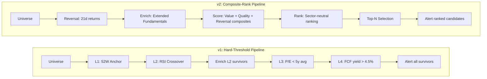
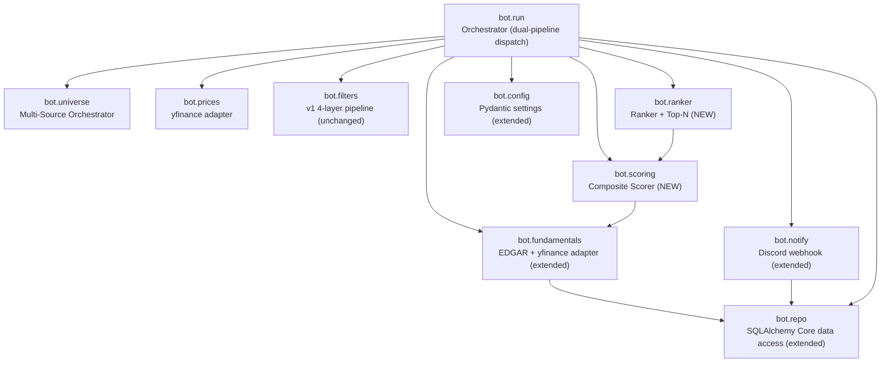
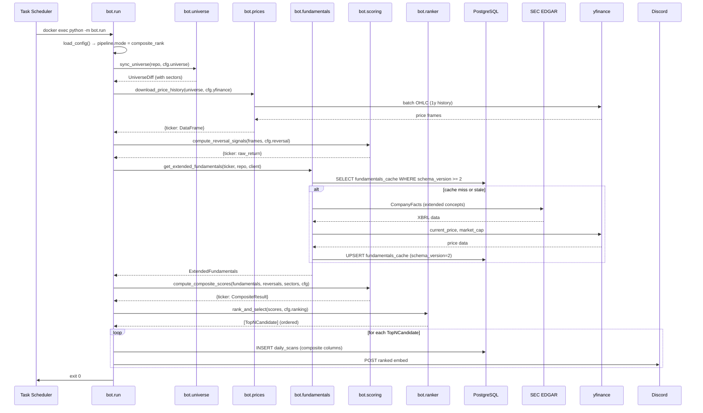
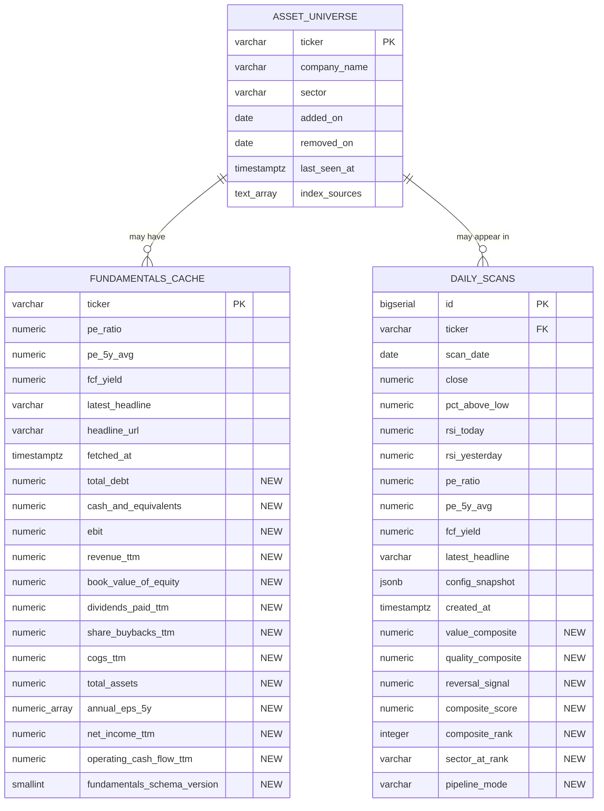

# Design Document: Composite Ranked Scoring

## Overview

This design transforms the Asset Discovery Bot from a binary pass/fail 4-layer tollbooth into a **ranked composite scorer** that combines multi-metric value, quality, and reversal signals into a single Composite_Score, ranks tickers within their GICS sector, and emits the top-N candidates per scan in priority order.

The upgrade implements Tier-1 roadmap items B–F from the v1 design as one coherent change:
- **B**: Multi-metric value composite (EV/EBIT, EV/Sales, B/M, Shareholder Yield) replaces single P/E threshold
- **C**: Multi-metric quality composite (GP/A, Earnings Stability, Low Accruals) replaces single FCF-yield threshold
- **D**: Short-term reversal signal (Jegadeesh 1990, trailing 21-day return) replaces RSI crossover
- **E**: Sector-neutral z-scoring prevents loading on whichever sector is currently cheap
- **F**: Top-N ranked output extracts more information from the cross-section than binary pass/fail

**Coexistence with v1.** The new pipeline is selectable via `pipeline.mode` in `config.yaml`. When set to `hard_threshold` (the default), the bot executes the unchanged v1 L1→L2→L3→L4 pipeline. When set to `composite_rank`, the bot executes the new universe→reversal→enrich→score→rank→top-N pipeline. Both modes share the same database schema, universe sync, and notification infrastructure.

**Deployment constraints preserved:**
- Synology DS220+ (2 GB RAM, 512 MB Postgres cap)
- Zero additional cost (all data from EDGAR XBRL + yfinance)
- EDGAR rate limit (10 req/sec) via existing `EdgarRateLimiter`
- SQLAlchemy Core 2.0, Pydantic frozen models, Python 3.11

## Architecture

### Pipeline Flow Comparison



### System Context (Unchanged)

The external data sources remain identical: Wikipedia (universe), iShares CSV (universe), yfinance (prices), SEC EDGAR XBRL (fundamentals), Discord (alerts). The only internal structural change is the addition of two new modules (`bot.scoring`, `bot.ranker`) and extended config models.

### Component Diagram



### End-to-End Data Flow (Composite-Rank Mode)



## Components and Interfaces

### New Component: `bot.scoring` — Composite Scorer

**Purpose:** Compute Value_Composite, Quality_Composite, Reversal_Signal, and the final Composite_Score for every ticker in the scored universe.

**Responsibilities:**
- Compute individual metrics from Extended_Fundamentals (EV/EBIT, EV/Sales, B/M, Shareholder_Yield, GP/A, Earnings_Stability, Low_Accruals)
- Compute cross-sectional z-scores (optionally sector-neutral)
- Apply inversions (EV/EBIT, EV/Sales get negated z-scores)
- Average z-scores into Value_Composite and Quality_Composite
- Compute Reversal_Signal from negated trailing 21-day returns
- Combine into Composite_Score using configured weights
- Exclude tickers with incomplete data (log at DEBUG)
- Fall back to cross-sectional z-scoring for undersized sectors (log at WARN)

```python
from __future__ import annotations
from dataclasses import dataclass
from typing import Any

@dataclass(frozen=True)
class CompositeResult:
    """Scoring output for one ticker."""
    ticker: str
    sector: str
    value_composite: float
    quality_composite: float
    reversal_signal: float
    composite_score: float
    # Individual metrics preserved for audit
    ev_ebit: float | None
    ev_sales: float | None
    book_to_market: float | None
    shareholder_yield: float | None
    gp_a: float | None
    earnings_stability: float | None
    low_accruals: float | None
    raw_reversal_return: float | None


@dataclass(frozen=True)
class ExtendedFundamentals:
    """Extended record from EDGAR with all fields needed by the scorer."""
    ticker: str
    # v1 fields (preserved)
    pe_ratio: float | None
    pe_5y_avg: float | None
    fcf_yield: float | None
    latest_headline: str | None
    headline_url: str | None
    fetched_at: datetime
    # v2 extended fields
    total_debt: float | None
    cash_and_equivalents: float | None
    ebit: float | None
    revenue_ttm: float | None
    book_value_of_equity: float | None
    dividends_paid_ttm: float | None
    share_buybacks_ttm: float | None
    cogs_ttm: float | None
    total_assets: float | None
    annual_eps_5y: list[float] | None  # up to 5 annual EPS values
    net_income_ttm: float | None
    operating_cash_flow_ttm: float | None
    market_cap: float | None
    schema_version: int


class CompositeScorer:
    """Stateless scorer — all state flows through method arguments."""

    def __init__(self, cfg: ScoringConfig, ranking_cfg: RankingConfig): ...

    def compute_value_metrics(
        self, f: ExtendedFundamentals
    ) -> dict[str, float | None]:
        """Derive EV/EBIT, EV/Sales, B/M, Shareholder_Yield from fundamentals.

        Returns dict with keys 'ev_ebit', 'ev_sales', 'book_to_market',
        'shareholder_yield'. Any key may be None if inputs are insufficient.
        """

    def compute_quality_metrics(
        self, f: ExtendedFundamentals
    ) -> dict[str, float | None]:
        """Derive GP/A, Earnings_Stability, Low_Accruals from fundamentals.

        Returns dict with keys 'gp_a', 'earnings_stability', 'low_accruals'.
        """

    def compute_reversal_signal(
        self,
        close_series: pd.Series,
        lookback_days: int,
    ) -> float | None:
        """Compute raw trailing return for one ticker. None if insufficient data."""

    def compute_composite_scores(
        self,
        fundamentals: dict[str, ExtendedFundamentals],
        reversal_returns: dict[str, float],
        sectors: dict[str, str],
    ) -> list[CompositeResult]:
        """Score all tickers. Handles sector-neutral z-scoring and fallback."""
```

### New Component: `bot.ranker` — Ranker + Top-N Selection

**Purpose:** Take Composite_Scores and produce Composite_Ranks with deterministic tie-breaking, then select the top-N candidates for emission.

```python
from __future__ import annotations
from dataclasses import dataclass

@dataclass(frozen=True)
class RankedCandidate:
    """A scored ticker with its assigned rank."""
    ticker: str
    sector: str
    composite_rank: int
    composite_score: float
    value_composite: float
    quality_composite: float
    reversal_signal: float
    # Preserved for embed rendering
    close: float
    market_cap: float | None
    latest_headline: str | None
    headline_url: str | None


class Ranker:
    """Stateless ranker — all state flows through method arguments."""

    def __init__(self, cfg: RankingConfig): ...

    def rank(
        self, scores: list[CompositeResult]
    ) -> list[RankedCandidate]:
        """Assign ranks. Sector-neutral or cross-sectional per config.

        Tie-breaking: lexicographic ascending on ticker symbol.
        Ranks within each sector (or globally) form {1, 2, ..., k}.
        """

    def select_top_n(
        self, ranked: list[RankedCandidate]
    ) -> list[RankedCandidate]:
        """Select top_n_per_sector (sector-neutral) or top_n (cross-sectional).

        Returns candidates ordered by composite_score descending,
        ties broken by ticker ascending.
        """
```

### Extended Component: `bot.config` — New Config Models

```python
from enum import Enum

class PipelineMode(str, Enum):
    """Selects between v1 hard-threshold and v2 composite-rank pipelines."""
    HARD_THRESHOLD = "hard_threshold"
    COMPOSITE_RANK = "composite_rank"


class PipelineConfig(BaseModel):
    """Top-level pipeline selection."""
    mode: PipelineMode = PipelineMode.HARD_THRESHOLD


class ScoringConfig(BaseModel):
    """Composite scoring weights. All weights in [0.0, 10.0]."""
    value_weight: float = Field(1.0, ge=0.0, le=10.0)
    quality_weight: float = Field(1.0, ge=0.0, le=10.0)
    reversal_weight: float = Field(0.5, ge=0.0, le=10.0)

    @field_validator("reversal_weight")
    @classmethod
    def _not_all_zero(cls, v: float, info: ValidationInfo) -> float:
        """Reject degenerate config where all weights are zero."""
        vw = info.data.get("value_weight", 1.0)
        qw = info.data.get("quality_weight", 1.0)
        if vw == 0.0 and qw == 0.0 and v == 0.0:
            raise ValueError(
                "At least one scoring weight must be non-zero"
            )
        return v


class RankingConfig(BaseModel):
    """Ranking and top-N selection parameters."""
    sector_neutral: bool = True
    top_n: int = Field(20, ge=1, le=500)
    top_n_per_sector: int = Field(2, ge=1, le=50)
    min_sector_size: int = Field(5, ge=1, le=50)


class ReversalConfig(BaseModel):
    """Short-term reversal signal parameters."""
    enabled: bool = True
    lookback_days: int = Field(21, ge=5, le=252)


# Updated AppConfig adds these sections:
class AppConfig(BaseModel):
    model_config = {"frozen": True}

    # v1 sections (preserved)
    layer1: Layer1Config = Field(default_factory=Layer1Config)
    layer2: Layer2Config = Field(default_factory=Layer2Config)
    layer3: Layer3Config = Field(default_factory=Layer3Config)
    layer4: Layer4Config = Field(default_factory=Layer4Config)
    cache: CacheConfig = Field(default_factory=CacheConfig)
    universe: UniverseConfig = Field(default_factory=UniverseConfig)
    notification: NotificationConfig = Field(default_factory=NotificationConfig)
    fmp: FmpConfig = Field(default_factory=FmpConfig)
    yfinance: YFinanceConfig = Field(default_factory=YFinanceConfig)
    logging: LoggingConfig = Field(default_factory=LoggingConfig)

    # v2 sections (new)
    pipeline: PipelineConfig = Field(default_factory=PipelineConfig)
    scoring: ScoringConfig = Field(default_factory=ScoringConfig)
    ranking: RankingConfig = Field(default_factory=RankingConfig)
    reversal: ReversalConfig = Field(default_factory=ReversalConfig)
```

### Extended Component: `bot.fundamentals` — Extended XBRL Concepts

The Fundamentals_Service gains new EDGAR XBRL concept lookups. Each new field maps to one or more XBRL concepts in documented fallback order:

| Field | Primary XBRL Concept | Fallback(s) |
|-------|---------------------|-------------|
| `total_debt` | `LongTermDebt` + `ShortTermBorrowings` | `DebtCurrent` + `LongTermDebtNoncurrent` |
| `cash_and_equivalents` | `CashAndCashEquivalentsAtCarryingValue` | `Cash` |
| `ebit` | `OperatingIncomeLoss` | `IncomeLossFromContinuingOperationsBeforeIncomeTaxes...` → computed `NetIncome + InterestExpense + IncomeTaxExpense` |
| `revenue_ttm` | `Revenues` (TTM sum) | `RevenueFromContractWithCustomerExcludingAssessedTax` |
| `book_value_of_equity` | `StockholdersEquity` | `StockholdersEquityIncludingPortionAttributableToNoncontrollingInterest` |
| `dividends_paid_ttm` | `PaymentsOfDividends` (TTM sum) | `PaymentsOfDividendsCommonStock` |
| `share_buybacks_ttm` | `PaymentsForRepurchaseOfCommonStock` (TTM sum) | `PaymentsForRepurchaseOfEquity` |
| `cogs_ttm` | `CostOfGoodsAndServicesSold` (TTM sum) | `CostOfRevenue` |
| `total_assets` | `Assets` (latest quarter) | — |
| `annual_eps_5y` | `EarningsPerShareDiluted` (FY entries, up to 5) | Already implemented |
| `net_income_ttm` | `NetIncomeLoss` (TTM sum) | `ProfitLoss` |
| `operating_cash_flow_ttm` | `NetCashProvidedByUsedInOperatingActivities` (TTM sum) | Already implemented |

The `FundamentalsClient.fetch()` method is extended to populate these fields. The cache gating semantics are preserved: a row with `fundamentals_schema_version >= 2` and `fetched_at` within the staleness window is served from cache. A row with `schema_version < 2` is treated as stale when `pipeline.mode = composite_rank`.

### Extended Component: `bot.run` — Dual-Pipeline Dispatch

```python
def main() -> int:
    # ... existing config + engine + universe sync (unchanged) ...

    if cfg.pipeline.mode == PipelineMode.HARD_THRESHOLD:
        return _run_hard_threshold_pipeline(cfg, secrets, repo, universe, ...)
    else:
        return _run_composite_rank_pipeline(cfg, secrets, repo, universe, ...)
```

The `_run_composite_rank_pipeline` function:
1. Downloads price history (same as v1)
2. Computes reversal signals from price frames
3. Fetches Extended_Fundamentals for the full universe (cache-gated)
4. Calls `CompositeScorer.compute_composite_scores()`
5. Calls `Ranker.rank()` then `Ranker.select_top_n()`
6. Persists each Top_N_Candidate to `daily_scans` (insert-before-alert)
7. Posts ranked Discord embeds

### Extended Component: `bot.notify` — Ranked Embed Format

New embed builder for Top_N_Candidates:

```python
def _build_ranked_candidate_embed(candidate: RankedCandidate) -> dict[str, Any]:
    """Green embed for one ranked candidate.

    Fields:
      - Rank: #1 in {sector}
      - Composite Score: 2.34
      - Value / Quality / Reversal: 1.2 / 0.8 / 0.3
      - Close: $142.50
      - Market Cap: $45.2B
      - Latest Catalyst: [headline](url)

    Footer: "Composite rank — for human review"
    """
```

## Data Models

### Updated Entity-Relationship Diagram



### Migration SQL: `003_composite_ranked_scoring.sql`

```sql
-- Composite Ranked Scoring — extend fundamentals_cache and daily_scans
--
-- Applied by bot/migrations/run_migrations.py in lexicographic order
-- after 002_universe_expansion.sql. Uses ADD COLUMN IF NOT EXISTS with
-- server defaults so existing rows populate without a full table rewrite.
-- Idempotent: re-running is a no-op (Req 8.4).
--
-- Requirements traceability:
--   8.1 — Extended fundamentals columns on fundamentals_cache.
--   8.2 — Composite scoring columns on daily_scans.
--   8.3 — ADD COLUMN IF NOT EXISTS with server defaults (no rewrite).
--   8.4 — Idempotent (IF NOT EXISTS).
--   8.5 — Existing v1 columns unchanged.

-- ============================================================
-- fundamentals_cache: extended fields for composite scoring
-- ============================================================

ALTER TABLE fundamentals_cache
    ADD COLUMN IF NOT EXISTS total_debt NUMERIC(16, 2);

ALTER TABLE fundamentals_cache
    ADD COLUMN IF NOT EXISTS cash_and_equivalents NUMERIC(16, 2);

ALTER TABLE fundamentals_cache
    ADD COLUMN IF NOT EXISTS ebit NUMERIC(16, 2);

ALTER TABLE fundamentals_cache
    ADD COLUMN IF NOT EXISTS revenue_ttm NUMERIC(16, 2);

ALTER TABLE fundamentals_cache
    ADD COLUMN IF NOT EXISTS book_value_of_equity NUMERIC(16, 2);

ALTER TABLE fundamentals_cache
    ADD COLUMN IF NOT EXISTS dividends_paid_ttm NUMERIC(16, 2);

ALTER TABLE fundamentals_cache
    ADD COLUMN IF NOT EXISTS share_buybacks_ttm NUMERIC(16, 2);

ALTER TABLE fundamentals_cache
    ADD COLUMN IF NOT EXISTS cogs_ttm NUMERIC(16, 2);

ALTER TABLE fundamentals_cache
    ADD COLUMN IF NOT EXISTS total_assets NUMERIC(16, 2);

ALTER TABLE fundamentals_cache
    ADD COLUMN IF NOT EXISTS annual_eps_5y NUMERIC(12, 4)[];

ALTER TABLE fundamentals_cache
    ADD COLUMN IF NOT EXISTS net_income_ttm NUMERIC(16, 2);

ALTER TABLE fundamentals_cache
    ADD COLUMN IF NOT EXISTS operating_cash_flow_ttm NUMERIC(16, 2);

ALTER TABLE fundamentals_cache
    ADD COLUMN IF NOT EXISTS fundamentals_schema_version SMALLINT NOT NULL DEFAULT 1;

-- ============================================================
-- daily_scans: composite scoring output columns
-- ============================================================

ALTER TABLE daily_scans
    ADD COLUMN IF NOT EXISTS value_composite NUMERIC(10, 6);

ALTER TABLE daily_scans
    ADD COLUMN IF NOT EXISTS quality_composite NUMERIC(10, 6);

ALTER TABLE daily_scans
    ADD COLUMN IF NOT EXISTS reversal_signal NUMERIC(10, 6);

ALTER TABLE daily_scans
    ADD COLUMN IF NOT EXISTS composite_score NUMERIC(10, 6);

ALTER TABLE daily_scans
    ADD COLUMN IF NOT EXISTS composite_rank INTEGER;

ALTER TABLE daily_scans
    ADD COLUMN IF NOT EXISTS sector_at_rank VARCHAR(64);

ALTER TABLE daily_scans
    ADD COLUMN IF NOT EXISTS pipeline_mode VARCHAR(32);
```

### Config YAML Example (Composite-Rank Mode)

```yaml
# Pipeline mode: "hard_threshold" (v1 default) or "composite_rank" (v2)
pipeline:
  mode: "composite_rank"

# Composite scoring weights (applied to z-score composites)
scoring:
  value_weight: 1.0       # Weight for Value_Composite
  quality_weight: 1.0     # Weight for Quality_Composite
  reversal_weight: 0.5    # Weight for Reversal_Signal

# Ranking and top-N selection
ranking:
  sector_neutral: true    # z-score within GICS sector
  top_n: 20              # Cross-sectional top-N (when sector_neutral=false)
  top_n_per_sector: 2    # Per-sector top-N (when sector_neutral=true)
  min_sector_size: 5     # Minimum tickers for sector-neutral z-scoring

# Short-term reversal signal (Jegadeesh 1990)
reversal:
  enabled: true
  lookback_days: 21      # Trading days for trailing return

# v1 layer sections remain valid (used when pipeline.mode = hard_threshold)
layer1:
  pct_above_low_min: 0.05
  pct_above_low_max: 0.15
# ... (layer2, layer3, layer4 unchanged)
```


## Algorithmic Pseudocode

### Value Metric Computation

```pascal
ALGORITHM compute_value_metrics(f: ExtendedFundamentals)
INPUT:  f — one ticker's extended fundamentals record
OUTPUT: dict with keys {ev_ebit, ev_sales, book_to_market, shareholder_yield}

BEGIN
  // Enterprise Value = market_cap + total_debt - cash
  IF f.market_cap IS NULL OR f.total_debt IS NULL OR f.cash_and_equivalents IS NULL THEN
    ev ← NULL
  ELSE
    ev ← f.market_cap + f.total_debt - f.cash_and_equivalents
  END IF

  // EV/EBIT (lower = cheaper; will be inverted during z-scoring)
  IF ev IS NOT NULL AND f.ebit IS NOT NULL AND f.ebit > 0 THEN
    ev_ebit ← ev / f.ebit
  ELSE
    ev_ebit ← NULL
  END IF

  // EV/Sales (lower = cheaper; will be inverted during z-scoring)
  IF ev IS NOT NULL AND f.revenue_ttm IS NOT NULL AND f.revenue_ttm > 0 THEN
    ev_sales ← ev / f.revenue_ttm
  ELSE
    ev_sales ← NULL
  END IF

  // Book-to-Market (higher = cheaper; no inversion needed)
  IF f.book_value_of_equity IS NOT NULL AND f.market_cap IS NOT NULL AND f.market_cap > 0 THEN
    book_to_market ← f.book_value_of_equity / f.market_cap
  ELSE
    book_to_market ← NULL
  END IF

  // Shareholder Yield = (dividends + buybacks) / market_cap
  IF f.market_cap IS NOT NULL AND f.market_cap > 0 THEN
    divs ← f.dividends_paid_ttm IF NOT NULL ELSE 0
    buybacks ← f.share_buybacks_ttm IF NOT NULL ELSE 0
    IF divs = 0 AND buybacks = 0 AND f.dividends_paid_ttm IS NULL AND f.share_buybacks_ttm IS NULL THEN
      shareholder_yield ← NULL
    ELSE
      shareholder_yield ← (abs(divs) + abs(buybacks)) / f.market_cap
    END IF
  ELSE
    shareholder_yield ← NULL
  END IF

  RETURN {ev_ebit, ev_sales, book_to_market, shareholder_yield}
END
```

### Quality Metric Computation

```pascal
ALGORITHM compute_quality_metrics(f: ExtendedFundamentals)
INPUT:  f — one ticker's extended fundamentals record
OUTPUT: dict with keys {gp_a, earnings_stability, low_accruals}

BEGIN
  // GP/A = (revenue - COGS) / total_assets (Novy-Marx 2013)
  IF f.revenue_ttm IS NOT NULL AND f.cogs_ttm IS NOT NULL AND f.total_assets IS NOT NULL AND f.total_assets > 0 THEN
    gp_a ← (f.revenue_ttm - f.cogs_ttm) / f.total_assets
  ELSE
    gp_a ← NULL
  END IF

  // Earnings_Stability = -stddev(annual_eps_5y)
  IF f.annual_eps_5y IS NOT NULL AND len(f.annual_eps_5y) >= 3 THEN
    earnings_stability ← -stddev(f.annual_eps_5y)
  ELSE
    earnings_stability ← NULL
  END IF

  // Low_Accruals = -(net_income - operating_cash_flow) / total_assets
  IF f.net_income_ttm IS NOT NULL AND f.operating_cash_flow_ttm IS NOT NULL
     AND f.total_assets IS NOT NULL AND f.total_assets > 0 THEN
    accruals ← (f.net_income_ttm - f.operating_cash_flow_ttm) / f.total_assets
    low_accruals ← -accruals
  ELSE
    low_accruals ← NULL
  END IF

  RETURN {gp_a, earnings_stability, low_accruals}
END
```

### Cross-Sectional Z-Score Computation

```pascal
ALGORITHM compute_z_scores(values: list[float], sector_neutral: bool, sectors: dict, min_sector_size: int)
INPUT:  values — list of (ticker, metric_value) pairs
        sector_neutral — whether to z-score within sector
        sectors — ticker -> GICS sector mapping
        min_sector_size — minimum tickers for sector-neutral scoring
OUTPUT: dict of ticker -> z-score

BEGIN
  IF NOT sector_neutral THEN
    // Cross-sectional z-scoring
    all_values ← [v for (_, v) in values]
    mu ← mean(all_values)
    sigma ← stddev(all_values)  // population stddev
    IF sigma = 0 THEN sigma ← 1.0  // avoid division by zero; all z-scores = 0
    RETURN {ticker: (v - mu) / sigma for (ticker, v) in values}
  END IF

  // Sector-neutral z-scoring
  // Partition by sector
  by_sector ← group values by sectors[ticker]
  result ← {}

  // Identify undersized sectors that need fallback
  undersized_tickers ← []
  FOR each (sector, sector_values) IN by_sector DO
    IF len(sector_values) < min_sector_size THEN
      LOG WARN "Sector %s has %d tickers (< min_sector_size=%d); falling back to cross-sectional"
      undersized_tickers.extend(sector_values)
    ELSE
      mu ← mean([v for (_, v) in sector_values])
      sigma ← stddev([v for (_, v) in sector_values])
      IF sigma = 0 THEN sigma ← 1.0
      FOR each (ticker, v) IN sector_values DO
        result[ticker] ← (v - mu) / sigma
      END FOR
    END IF
  END FOR

  // Fallback: z-score undersized sectors against the full cross-section
  IF undersized_tickers THEN
    all_values ← [v for (_, v) in values]  // full cross-section
    mu ← mean(all_values)
    sigma ← stddev(all_values)
    IF sigma = 0 THEN sigma ← 1.0
    FOR each (ticker, v) IN undersized_tickers DO
      result[ticker] ← (v - mu) / sigma
    END FOR
  END IF

  RETURN result
END
```

### Composite Score Computation

```pascal
ALGORITHM compute_composite_scores(fundamentals, reversal_returns, sectors, cfg)
INPUT:  fundamentals — dict of ticker -> ExtendedFundamentals
        reversal_returns — dict of ticker -> raw trailing return (or None)
        sectors — dict of ticker -> GICS sector string
        cfg — ScoringConfig + RankingConfig + ReversalConfig
OUTPUT: list of CompositeResult

BEGIN
  // Phase 1: Compute raw metrics for all tickers
  value_metrics ← {}   // ticker -> {ev_ebit, ev_sales, book_to_market, shareholder_yield}
  quality_metrics ← {} // ticker -> {gp_a, earnings_stability, low_accruals}

  FOR each (ticker, f) IN fundamentals DO
    value_metrics[ticker] ← compute_value_metrics(f)
    quality_metrics[ticker] ← compute_quality_metrics(f)
  END FOR

  // Phase 2: Filter to tickers with complete data for each composite
  value_eligible ← {t: m for (t, m) in value_metrics IF all values non-null}
  quality_eligible ← {t: m for (t, m) in quality_metrics IF all values non-null}
  reversal_eligible ← {t: r for (t, r) in reversal_returns IF r IS NOT NULL}

  // Log exclusions at DEBUG
  FOR each excluded ticker DO
    LOG DEBUG "Excluded %s from %s scoring: missing %s"
  END FOR

  // Phase 3: Z-score each metric (sector-neutral or cross-sectional)
  // Value z-scores (EV/EBIT and EV/Sales are INVERTED)
  ev_ebit_z ← compute_z_scores([(t, m.ev_ebit) for t, m in value_eligible], ...)
  ev_ebit_z ← {t: -z for t, z in ev_ebit_z}  // INVERT: lower ratio = better
  ev_sales_z ← compute_z_scores([(t, m.ev_sales) for t, m in value_eligible], ...)
  ev_sales_z ← {t: -z for t, z in ev_sales_z}  // INVERT: lower ratio = better
  bm_z ← compute_z_scores([(t, m.book_to_market) for t, m in value_eligible], ...)
  sy_z ← compute_z_scores([(t, m.shareholder_yield) for t, m in value_eligible], ...)

  // Quality z-scores (all higher = better, no inversion)
  gpa_z ← compute_z_scores([(t, m.gp_a) for t, m in quality_eligible], ...)
  es_z ← compute_z_scores([(t, m.earnings_stability) for t, m in quality_eligible], ...)
  la_z ← compute_z_scores([(t, m.low_accruals) for t, m in quality_eligible], ...)

  // Reversal z-score (negate raw return: lower return = higher signal)
  IF cfg.reversal.enabled THEN
    rev_z ← compute_z_scores([(t, -r) for t, r in reversal_eligible], ...)
  ELSE
    rev_z ← {t: 0.0 for t in reversal_eligible}
  END IF

  // Phase 4: Compute composites
  results ← []
  scoreable ← value_eligible ∩ quality_eligible ∩ reversal_eligible

  FOR each ticker IN scoreable DO
    value_composite ← mean(ev_ebit_z[t], ev_sales_z[t], bm_z[t], sy_z[t])
    quality_composite ← mean(gpa_z[t], es_z[t], la_z[t])
    reversal_signal ← rev_z[t]

    composite_score ← (
        cfg.scoring.value_weight * value_composite
      + cfg.scoring.quality_weight * quality_composite
      + cfg.scoring.reversal_weight * reversal_signal
    )

    results.append(CompositeResult(
      ticker=ticker,
      sector=sectors[ticker],
      value_composite=value_composite,
      quality_composite=quality_composite,
      reversal_signal=reversal_signal,
      composite_score=composite_score,
      ...
    ))
  END FOR

  RETURN results
END
```

### Ranking Algorithm with Deterministic Tie-Breaking

```pascal
ALGORITHM rank(scores: list[CompositeResult], cfg: RankingConfig)
INPUT:  scores — list of CompositeResult from the scorer
        cfg — RankingConfig (sector_neutral, top_n, top_n_per_sector)
OUTPUT: list of RankedCandidate with assigned ranks

BEGIN
  IF cfg.sector_neutral THEN
    // Partition by sector
    by_sector ← group scores by score.sector

    all_ranked ← []
    FOR each (sector, sector_scores) IN by_sector DO
      // Sort: composite_score DESC, then ticker ASC (tie-break)
      sorted_scores ← sort(sector_scores,
        key=(-composite_score, ticker_ascending))

      // Assign contiguous ranks {1, 2, ..., k}
      FOR i, score IN enumerate(sorted_scores, start=1) DO
        all_ranked.append(RankedCandidate(
          ticker=score.ticker,
          sector=sector,
          composite_rank=i,
          composite_score=score.composite_score,
          ...
        ))
      END FOR
    END FOR

    RETURN all_ranked

  ELSE
    // Cross-sectional ranking
    sorted_scores ← sort(scores,
      key=(-composite_score, ticker_ascending))

    ranked ← []
    FOR i, score IN enumerate(sorted_scores, start=1) DO
      ranked.append(RankedCandidate(
        ticker=score.ticker,
        sector=score.sector,
        composite_rank=i,
        composite_score=score.composite_score,
        ...
      ))
    END FOR

    RETURN ranked
  END IF
END
```

### Top-N Selection

```pascal
ALGORITHM select_top_n(ranked: list[RankedCandidate], cfg: RankingConfig)
INPUT:  ranked — all ranked candidates
        cfg — RankingConfig
OUTPUT: list of top-N candidates, ordered by composite_score DESC

BEGIN
  IF cfg.sector_neutral THEN
    // Select top_n_per_sector from each sector
    selected ← []
    FOR each (sector, sector_ranked) IN group(ranked, by=sector) DO
      top_in_sector ← sector_ranked WHERE composite_rank <= cfg.top_n_per_sector
      selected.extend(top_in_sector)
    END FOR
  ELSE
    // Select top_n overall
    selected ← ranked WHERE composite_rank <= cfg.top_n
  END IF

  // Final ordering: composite_score DESC, ticker ASC (tie-break)
  selected ← sort(selected, key=(-composite_score, ticker_ascending))

  RETURN selected
END
```

### Orchestrator: Composite-Rank Pipeline

```pascal
ALGORITHM run_composite_rank_pipeline(cfg, secrets, repo, universe, engine)
INPUT:  cfg — AppConfig, secrets — Secrets, repo — Repository,
        universe — sorted list of active tickers, engine — SQLAlchemy Engine
OUTPUT: exit code

BEGIN
  LOG INFO "Pipeline mode: composite_rank, weights: v=%.1f q=%.1f r=%.1f"

  // Phase 1: Download price history (same as v1)
  frames ← download_price_history(universe, cfg.yfinance)

  // Phase 2: Compute reversal signals from price frames
  scorer ← CompositeScorer(cfg.scoring, cfg.ranking)
  reversal_returns ← {}
  FOR each (ticker, frame) IN frames DO
    IF cfg.reversal.enabled THEN
      ret ← scorer.compute_reversal_signal(frame["Close"], cfg.reversal.lookback_days)
      IF ret IS NOT NULL THEN
        reversal_returns[ticker] ← ret
      ELSE
        LOG WARN "Ticker %s has insufficient price history for reversal signal"
      END IF
    ELSE
      reversal_returns[ticker] ← 0.0
    END IF
  END FOR

  // Phase 3: Fetch Extended_Fundamentals for all tickers with reversal data
  fmp_client ← FundamentalsClient(cfg=cfg.fmp)
  fundamentals ← {}
  FOR each ticker IN reversal_returns.keys() DO
    f ← get_extended_fundamentals(ticker, repo, fmp_client, cfg.cache.fundamentals_staleness_days, pipeline_mode="composite_rank")
    fundamentals[ticker] ← f
  END FOR

  // Phase 4: Load sector assignments
  sectors ← {ticker: sector FROM asset_universe WHERE ticker IN fundamentals.keys()}
  // Replace null sectors with "unknown"
  FOR each ticker WHERE sectors[ticker] IS NULL DO
    sectors[ticker] ← "unknown"
    LOG WARN "Ticker %s has null sector; assigned to 'unknown'"
  END FOR

  // Phase 5: Score
  results ← scorer.compute_composite_scores(fundamentals, reversal_returns, sectors)
  LOG INFO "Scoring: %d tickers scored out of %d universe" % (len(results), len(universe))

  IF results is empty THEN
    LOG INFO "No tickers scored; nothing to emit"
    RETURN EXIT_OK
  END IF

  // Phase 6: Rank + select top-N
  ranker ← Ranker(cfg.ranking)
  all_ranked ← ranker.rank(results)
  top_n ← ranker.select_top_n(all_ranked)
  LOG INFO "Ranking: %d candidates selected (top_n_per_sector=%d)" % (len(top_n), cfg.ranking.top_n_per_sector)

  // Phase 7: Persist + alert (insert-before-alert contract preserved)
  today ← date.today()
  config_snapshot ← cfg.model_dump(mode="json")
  notify_failure_count ← 0

  FOR each candidate IN top_n DO
    // Populate legacy NOT NULL columns with fallback values
    scan_row ← {
      ticker: candidate.ticker,
      close: candidate.close,
      pct_above_low: 0,        // not computed in composite mode
      rsi_today: 0,            // replaced by reversal signal
      rsi_yesterday: 0,        // replaced by reversal signal
      pe_ratio: fundamentals[candidate.ticker].pe_ratio OR 0,
      pe_5y_avg: fundamentals[candidate.ticker].pe_5y_avg OR 0,
      fcf_yield: fundamentals[candidate.ticker].fcf_yield OR 0,
      latest_headline: fundamentals[candidate.ticker].latest_headline,
      // New composite columns
      value_composite: candidate.value_composite,
      quality_composite: candidate.quality_composite,
      reversal_signal: candidate.reversal_signal,
      composite_score: candidate.composite_score,
      composite_rank: candidate.composite_rank,
      sector_at_rank: candidate.sector,
      pipeline_mode: "composite_rank",
    }

    TRY
      repo.insert_scan(scan_row, today, config_snapshot)
    CATCH DuplicateScanError:
      LOG INFO "Duplicate scan for %s on %s; skipping alert"
      CONTINUE
    END TRY

    TRY
      send_ranked_candidate(candidate, secrets.discord_webhook_url, cfg.notification)
    CATCH NotificationError:
      LOG ERROR "Failed to deliver ranked alert for %s"
      notify_failure_count += 1
    END TRY
  END FOR

  IF notify_failure_count > 0 THEN
    RETURN EXIT_NOTIFY_ERROR
  END IF

  RETURN EXIT_OK
END
```


## Correctness Properties

*A property is a characteristic or behavior that should hold true across all valid executions of a system — essentially, a formal statement about what the system should do. Properties serve as the bridge between human-readable specifications and machine-verifiable correctness guarantees.*

### Property 1: Composite Score Formula

*For any* set of tickers with non-null Value_Composite, Quality_Composite, and Reversal_Signal, and *for any* valid scoring weights (value_weight, quality_weight, reversal_weight), the Composite_Score for each ticker SHALL equal `value_weight * value_composite + quality_weight * quality_composite + reversal_weight * reversal_signal`.

**Validates: Requirements 11.2, 1.4, 2.6**

### Property 2: Sector-Neutrality Closure

*For any* scored universe with Sector_Neutral_Ranking enabled, and *for any* sector `s` with at least `min_sector_size` tickers, the z-scores contributing to a ticker's Composite_Score SHALL be invariant to the addition or removal of tickers in other sectors. Equivalently: the z-score for ticker `t` in sector `s` SHALL be computed using only the metric values of tickers in sector `s`.

**Validates: Requirements 1.6, 2.7, 3.4, 4.2, 4.3, 11.4**

### Property 3: Rank Bijection Within Sector

*For any* Scan_Run with Sector_Neutral_Ranking enabled, and *for any* sector `s` containing `k` scored tickers, the set of Composite_Ranks assigned within `s` SHALL be exactly `{1, 2, ..., k}` — no gaps, no duplicates.

**Validates: Requirements 4.7, 11.5**

### Property 4: Deterministic Tie-Breaking

*For any* two tickers `t1` and `t2` in the same ranking scope (same sector when sector-neutral, or full universe otherwise) with identical Composite_Scores, the ticker with the lexicographically smaller symbol SHALL receive the numerically smaller (better) rank.

**Validates: Requirements 4.6, 11.6**

### Property 5: Top-N Output Bound

*For any* Scan_Run in composite_rank mode, the number of emitted candidates SHALL be at most `top_n_per_sector * |sectors_with_scored_tickers|` when Sector_Neutral_Ranking is enabled, or at most `top_n` when disabled. Within each sector, at most `top_n_per_sector` candidates SHALL be emitted.

**Validates: Requirements 5.1, 5.2, 11.7**

### Property 6: Scoring Determinism

*For any* fixed input (same universe, same fundamentals values, same price history, same sector assignments, same AppConfig), running the Composite_Scorer and Ranker SHALL produce identical Composite_Scores and Composite_Ranks on every invocation.

**Validates: Requirements 11.3**

### Property 7: Null Metric Exclusion

*For any* ticker with a null or non-finite value for any of the four value metrics (EV/EBIT, EV/Sales, B/M, Shareholder_Yield), that ticker SHALL be excluded from Value_Composite scoring. Similarly, *for any* ticker with a null or non-finite value for any of the three quality metrics (GP/A, Earnings_Stability, Low_Accruals), that ticker SHALL be excluded from Quality_Composite scoring.

**Validates: Requirements 1.5, 2.8**

### Property 8: Min Sector Size Fallback

*For any* sector containing fewer than `min_sector_size` tickers with non-null metrics, the z-scores for those tickers SHALL be computed against the full cross-section (all tickers regardless of sector) rather than against only the undersized sector.

**Validates: Requirements 1.7**

### Property 9: Scored Tickers Subset of Universe

*For any* Scan_Run in composite_rank mode, the set of tickers that receive a non-null Composite_Score SHALL be a subset of the active universe for that run.

**Validates: Requirements 11.1**

### Property 10: Z-Score Statistical Properties

*For any* cross-section of `n >= 2` tickers used to compute z-scores for a single metric, the resulting z-scores SHALL have a mean of approximately zero and a population standard deviation of approximately one (within floating-point tolerance).

**Validates: Requirements 1.2, 2.5, 3.3**

### Property 11: Metric Computation Correctness

*For any* ExtendedFundamentals record with all required fields non-null and positive denominators:
- EV/EBIT SHALL equal `(market_cap + total_debt - cash) / ebit`
- EV/Sales SHALL equal `(market_cap + total_debt - cash) / revenue_ttm`
- B/M SHALL equal `book_value_of_equity / market_cap`
- Shareholder_Yield SHALL equal `(|dividends_paid_ttm| + |share_buybacks_ttm|) / market_cap`
- GP/A SHALL equal `(revenue_ttm - cogs_ttm) / total_assets`
- Earnings_Stability SHALL equal `-stddev(annual_eps_5y)`
- Low_Accruals SHALL equal `-(net_income_ttm - operating_cash_flow_ttm) / total_assets`
- Raw reversal return SHALL equal `(close_today - close_21d_ago) / close_21d_ago`

**Validates: Requirements 2.2, 2.3, 2.4, 3.2, 1.3**

### Property 12: No Trading Language in Embeds

*For any* Top_N_Candidate emitted to Discord, the rendered embed text SHALL NOT contain the words "buy", "sell", "hold", "allocate", "position", or "size" in any form that instructs the reader to take a trading action.

**Validates: Requirements 5.8, 11.10**

## Error Handling

### Scenario 1: Ticker excluded from scoring (incomplete fundamentals)

**Condition:** A ticker in the active universe has null values for one or more metrics required by the composite scorer (e.g., EDGAR has no EBIT data for a financial company).
**Response:** The ticker is excluded from the relevant composite (value, quality, or both). If excluded from all three composites, it receives no Composite_Score and is not ranked. Exclusion is logged at DEBUG level with the ticker and missing metric names.
**Recovery:** Next run may succeed if EDGAR data becomes available. The cache staleness window ensures periodic re-fetches.

### Scenario 2: Undersized sector (fewer than min_sector_size tickers)

**Condition:** A GICS sector has fewer than `min_sector_size` (default 5) tickers with complete metrics after exclusions.
**Response:** Those tickers' z-scores are computed against the full cross-section instead of within-sector. A WARN log identifies the sector and its member count.
**Recovery:** Automatic — the fallback produces valid z-scores. The operator can lower `min_sector_size` if this happens frequently.

### Scenario 3: All tickers excluded from scoring

**Condition:** Every ticker in the universe has at least one null metric, resulting in zero scored tickers.
**Response:** The orchestrator logs INFO "No tickers scored; nothing to emit" and exits with `EXIT_OK`. No Discord messages are posted, no `daily_scans` rows are inserted.
**Recovery:** Investigate EDGAR data availability. May indicate a systemic EDGAR outage or a misconfigured universe with non-US tickers.

### Scenario 4: Zero standard deviation in z-score computation

**Condition:** All tickers in a z-score group have identical metric values (e.g., all EV/EBIT ratios are the same).
**Response:** The standard deviation is treated as 1.0, producing z-scores of 0.0 for all tickers in that group. This is mathematically correct (no dispersion = no information) and prevents division by zero.
**Recovery:** Automatic — degenerate z-scores propagate through the composite without crashing.

### Scenario 5: EDGAR rate limit sustained engagement

**Condition:** Fetching Extended_Fundamentals for the full universe (potentially 500+ tickers) sustains the EDGAR rate limiter for an extended period.
**Response:** The existing `EdgarRateLimiter` logs WARN after 30 consecutive seconds of throttling. The scan continues at 10 req/sec. With ~500 tickers and ~3 EDGAR calls per ticker, worst-case is ~150 seconds of sustained EDGAR traffic.
**Recovery:** Increase `cache.fundamentals_staleness_days` to reduce EDGAR call volume. The cache ensures that only stale/missing tickers trigger EDGAR calls.

### Scenario 6: Pipeline mode mismatch with daily_scans unique constraint

**Condition:** A ticker was already emitted today by the v1 hard-threshold pipeline, and the operator switches to composite_rank mode and re-runs.
**Response:** The `UNIQUE (ticker, scan_date)` constraint fires. `DuplicateScanError` is caught and the ticker is skipped (no duplicate Discord alert). This is the same at-least-once / at-most-once contract as v1.
**Recovery:** By design — the constraint prevents double-alerting regardless of pipeline mode.

### Scenario 7: Config validation failure (all weights zero)

**Condition:** Operator sets `scoring.value_weight = 0`, `scoring.quality_weight = 0`, `scoring.reversal_weight = 0`.
**Response:** Pydantic validation rejects the config with a `ValidationError` before any I/O. The bot exits with `EXIT_CONFIG_ERROR`.
**Recovery:** Operator fixes the config. At least one weight must be non-zero.

## Testing Strategy

### Property-Based Tests (Hypothesis)

The project uses **Hypothesis** (Python's property-based testing library) for all correctness properties. Each property test runs a minimum of 100 iterations with generated inputs.

**Test configuration:**
```python
from hypothesis import given, settings, HealthCheck
from hypothesis import strategies as st

@settings(max_examples=100, suppress_health_check=[HealthCheck.too_slow])
```

**Hypothesis strategies for domain types:**

```python
# Strategy: valid financial metrics (positive, finite floats)
positive_financial = st.floats(min_value=0.01, max_value=1e12, allow_nan=False, allow_infinity=False)

# Strategy: valid z-score inputs (finite floats, reasonable range)
metric_value = st.floats(min_value=-1e6, max_value=1e6, allow_nan=False, allow_infinity=False)

# Strategy: GICS sector names
gics_sector = st.sampled_from([
    "Energy", "Materials", "Industrials", "Consumer Discretionary",
    "Consumer Staples", "Health Care", "Financials",
    "Information Technology", "Communication Services", "Utilities", "Real Estate"
])

# Strategy: valid ticker symbols (1-5 uppercase letters)
ticker_symbol = st.text(
    alphabet=st.characters(whitelist_categories=("Lu",)),
    min_size=1, max_size=5
).map(lambda s: s.upper())

# Strategy: scoring weights (at least one non-zero)
scoring_weights = st.tuples(
    st.floats(min_value=0.0, max_value=10.0),
    st.floats(min_value=0.0, max_value=10.0),
    st.floats(min_value=0.0, max_value=10.0),
).filter(lambda w: w[0] + w[1] + w[2] > 0)

# Strategy: list of scored tickers with metrics
scored_ticker_set = st.lists(
    st.tuples(ticker_symbol, gics_sector, metric_value, metric_value, metric_value),
    min_size=2, max_size=50, unique_by=lambda t: t[0]
)
```

**Property test mapping:**

| Property | Test Tag | Key Assertion |
|----------|----------|---------------|
| 1: Composite Score Formula | `Feature: composite-ranked-scoring, Property 1: Composite Score Formula` | `score == vw*vc + qw*qc + rw*rs` within float tolerance |
| 2: Sector-Neutrality Closure | `Feature: composite-ranked-scoring, Property 2: Sector-Neutrality Closure` | Adding tickers to sector B doesn't change z-scores in sector A |
| 3: Rank Bijection | `Feature: composite-ranked-scoring, Property 3: Rank Bijection Within Sector` | `set(ranks_in_sector) == set(range(1, k+1))` |
| 4: Deterministic Tie-Breaking | `Feature: composite-ranked-scoring, Property 4: Deterministic Tie-Breaking` | Equal scores → lexicographically smaller ticker gets better rank |
| 5: Top-N Bound | `Feature: composite-ranked-scoring, Property 5: Top-N Output Bound` | `len(selected) <= top_n_per_sector * num_sectors` |
| 6: Scoring Determinism | `Feature: composite-ranked-scoring, Property 6: Scoring Determinism` | Two runs with same input produce identical output |
| 7: Null Exclusion | `Feature: composite-ranked-scoring, Property 7: Null Metric Exclusion` | Ticker with any null metric not in scored set |
| 8: Min Sector Fallback | `Feature: composite-ranked-scoring, Property 8: Min Sector Size Fallback` | Undersized sector tickers get cross-sectional z-scores |
| 9: Scored Subset | `Feature: composite-ranked-scoring, Property 9: Scored Tickers Subset of Universe` | `scored_tickers ⊆ universe` |
| 10: Z-Score Stats | `Feature: composite-ranked-scoring, Property 10: Z-Score Statistical Properties` | `mean(z) ≈ 0`, `std(z) ≈ 1` |
| 11: Metric Formulas | `Feature: composite-ranked-scoring, Property 11: Metric Computation Correctness` | Each formula matches expected computation |
| 12: No Trading Language | `Feature: composite-ranked-scoring, Property 12: No Trading Language in Embeds` | Forbidden words absent from embed text |

### Unit Tests

Unit tests cover specific examples and edge cases that complement the property tests:

- **Metric computation edge cases:** Zero denominators, negative EBIT, negative book value, single-year EPS history
- **Z-score edge cases:** Single-ticker sector, all-identical values, extreme outliers
- **Config validation:** Invalid pipeline mode string, weight exactly at boundary (0.0 and 10.0), top_n = 1
- **Reversal signal:** Exactly `lookback_days + 1` observations (minimum), reversal disabled produces zero
- **Ranking:** Single ticker in sector gets rank 1, empty sector produces no candidates
- **Embed rendering:** Verify all required fields present, verify no forbidden words, verify truncation at Discord limits
- **Migration idempotency:** Run migration twice, verify no error on second run
- **Schema version gating:** v1 cache row treated as stale in composite_rank mode

### Integration Tests

Integration tests verify the full pipeline end-to-end with mocked external services:

- **Full composite pipeline:** Mock EDGAR + yfinance, run from universe through to `daily_scans` insertion, verify row shape
- **Dual-pipeline coexistence:** Run hard_threshold then composite_rank on same day/ticker, verify unique constraint behavior
- **Cache gating:** Verify Extended_Fundamentals served from cache when fresh, refetched when stale or schema_version < 2
- **Discord embed delivery:** Mock webhook, verify embed payload matches expected shape for ranked candidates
- **Config snapshot reproducibility:** Load config from persisted `config_snapshot` JSONB, verify identical scoring output
