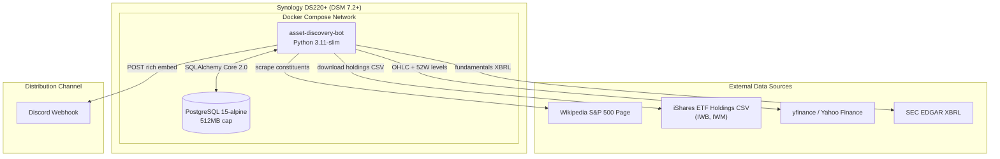
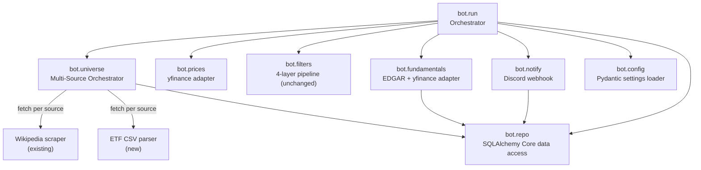
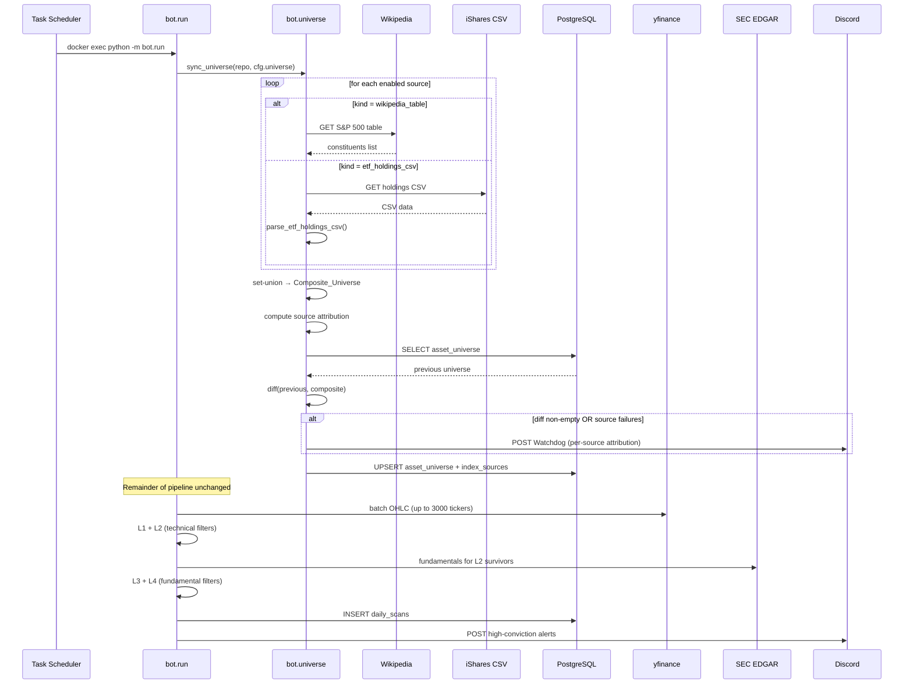
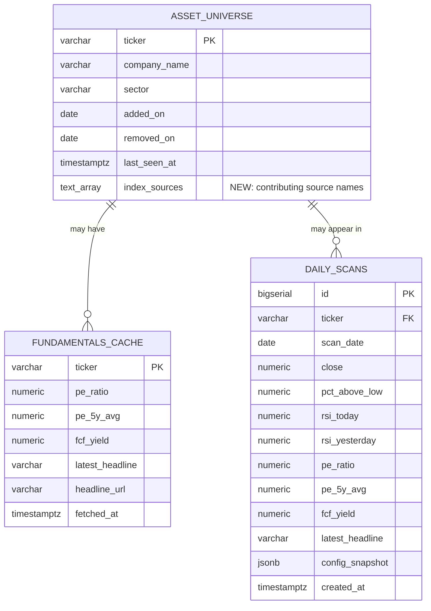

# Design Document: Universe Expansion

## Overview

This design extends the Asset Discovery Bot from a single S&P 500 Wikipedia source to a multi-source universe supporting Russell 1000 and Russell 3000 indices via iShares ETF holdings CSV files. The expansion is additive: every existing module continues to work unchanged for v1 configurations, and the new multi-source capability is opt-in via `config.yaml`.

The core change is that `bot.universe` evolves from a single-source Wikipedia scraper into a multi-source orchestrator that fetches from N configured sources, merges results into a Composite_Universe via set-union, and tracks per-ticker source attribution in a new `index_sources` TEXT[] column on `asset_universe`. Downstream modules (prices, fundamentals, filters, notify) receive the same flat ticker list they always have — the multi-source complexity is fully encapsulated in the universe and config layers.

**Key design constraints:**
- SQLAlchemy Core 2.0 (no ORM) — all new queries use `Table` + `select`/`insert`
- Pydantic `frozen=True` AppConfig — new config models follow the same pattern
- Filter pipeline is pure functions — no changes needed
- Fundamentals service already handles missing EDGAR data (returns None fields)
- yfinance batch download already exists in `bot.prices` — only needs progress logging for large universes
- 2 GB RAM host, 512 MB Postgres cap — memory-bounded batch processing

## Architecture

### System Context Changes

The existing architecture gains one new external data source (iShares CSV endpoints) and the Universe_Service becomes a multi-source orchestrator:



### Component Diagram Changes

The only structural change is inside `bot.universe` and `bot.config`. All other components receive the same interfaces:



### End-to-End Data Flow (Multi-Source)



## Components and Interfaces

### Modified Component: `bot.config` — Configuration Loader

**Changes:** Add `UniverseSourceConfig` model and update `UniverseConfig` to support an ordered list of sources with backward-compatible fallback.

```python
from typing import Literal

class UniverseSourceConfig(BaseModel):
    """One configured universe data source."""
    name: str                                          # unique identifier, e.g. "sp500_wikipedia"
    kind: Literal["wikipedia_table", "etf_holdings_csv"]
    url: str
    enabled: bool = True
    min_count: int = Field(0, ge=0)                    # per-source sanity lower bound
    max_count: int = Field(10000, ge=0)                # per-source sanity upper bound

class UniverseConfig(BaseModel):
    """Updated universe config with multi-source support."""
    # Legacy field — ignored when sources is present
    source_url: str = "https://en.wikipedia.org/wiki/List_of_S%26P_500_companies"

    # New multi-source field
    sources: list[UniverseSourceConfig] | None = None

    # Composite bounds (applied after set-union)
    min_composite_count: int = Field(450, ge=0)
    max_composite_count: int = Field(3200, ge=0)

    # Legacy per-source bounds (used when sources is None)
    min_constituent_count: int = Field(450, ge=0)
    max_constituent_count: int = Field(520, ge=0)

    # Scan time monitoring
    max_scan_minutes: int = Field(25, ge=1)

    @field_validator("sources")
    @classmethod
    def _unique_source_names(cls, v):
        """Reject duplicate source names (Req 1.3)."""
        if v is None:
            return v
        names = [s.name for s in v]
        if len(names) != len(set(names)):
            raise ValueError("universe.sources names must be unique")
        return v

    def effective_sources(self) -> list[UniverseSourceConfig]:
        """Return the resolved source list.

        If sources is configured, return it (ignoring source_url).
        Otherwise, construct a single-source fallback from the legacy
        fields so v1 configs produce identical behavior (Req 8.1).
        """
        if self.sources is not None:
            return [s for s in self.sources if s.enabled]
        return [
            UniverseSourceConfig(
                name="sp500_wikipedia",
                kind="wikipedia_table",
                url=self.source_url,
                enabled=True,
                min_count=self.min_constituent_count,
                max_count=self.max_constituent_count,
            )
        ]
```

### Modified Component: `bot.universe` — Multi-Source Orchestrator

**Changes:** The module gains an ETF CSV parser and a multi-source sync loop. The existing `fetch_current_constituents` is preserved as the `wikipedia_table` fetcher.

```python
from dataclasses import dataclass, field

@dataclass(frozen=True)
class SourceResult:
    """Result of fetching one Universe_Source."""
    name: str
    success: bool
    tickers: list[tuple[str, str, str | None]]  # (ticker, company_name, sector)
    error: str | None = None

@dataclass(frozen=True)
class UniverseDiff:
    """Extended diff with per-source attribution and failure info."""
    added: list[str]
    removed: list[str]
    as_of: date
    source_failures: list[tuple[str, str]] = field(default_factory=list)  # (name, reason)
    source_attribution: dict[str, list[str]] = field(default_factory=dict)  # ticker -> [source_names]
    composite_size: int = 0
    sources_enabled: int = 0
    sources_succeeded: int = 0

def parse_etf_holdings_csv(
    csv_text: str,
) -> list[tuple[str, str, str | None]]:
    """Parse an iShares ETF holdings CSV into (ticker, company_name, sector) triples.

    Handles the iShares preamble (non-tabular metadata rows before the
    actual column headers). Locates the header row by searching for a row
    containing both a Ticker/Symbol column and a Name column.

    Returns a sorted, deduplicated list of triples.
    """

def fetch_etf_holdings(
    source: UniverseSourceConfig,
    timeout: float = 15.0,
) -> list[tuple[str, str, str | None]]:
    """Download and parse an ETF holdings CSV from the configured URL."""

def fetch_source(
    source: UniverseSourceConfig,
) -> SourceResult:
    """Fetch one source, dispatching by kind. Returns SourceResult (never raises)."""

def sync_universe(
    repo: Repository,
    cfg: UniverseConfig,
) -> UniverseDiff:
    """Multi-source universe sync.

    1. Iterate enabled sources in config order, fetch each independently.
    2. Compute Composite_Universe as set-union of successful sources.
    3. Validate composite size against [min_composite_count, max_composite_count].
    4. If all sources fail, raise UniverseSyncError (no DB mutation).
    5. Compute per-ticker source attribution.
    6. Diff against previous active universe.
    7. Upsert with index_sources.
    8. Return extended UniverseDiff.
    """
```

### Modified Component: `bot.repo` — Data Access Layer

**Changes:** Add `index_sources` column to the `asset_universe` Table declaration. Update `upsert_universe` to write `index_sources`. Optionally expose `index_sources` in load methods.

```python
# Updated Table declaration
asset_universe = Table(
    "asset_universe",
    metadata,
    Column("ticker", String(10), primary_key=True),
    Column("company_name", String(255), nullable=False),
    Column("sector", String(64), nullable=True),
    Column("added_on", Date, nullable=False, server_default=func.current_date()),
    Column("removed_on", Date, nullable=True),
    Column(
        "last_seen_at",
        DateTime(timezone=True),
        nullable=False,
        server_default=func.now(),
    ),
    Column(
        "index_sources",
        ARRAY(String),
        nullable=False,
        server_default=text("'{}'::TEXT[]"),
    ),
)

# Updated upsert_universe signature
def upsert_universe(
    self,
    entries: list[tuple[str, str, str | None]],
    as_of: date,
    source_attribution: dict[str, list[str]] | None = None,
) -> None:
    """Upsert universe with optional per-ticker source attribution.

    When source_attribution is provided, each ticker's index_sources
    column is set to the list of source names that contributed it.
    When None (v1 compat), index_sources is not modified.
    """
```

### Modified Component: `bot.notify` — Discord Webhook Publisher

**Changes:** Update `send_watchdog` to accept the extended `UniverseDiff` and render per-source attribution and source failure information.

```python
def _build_watchdog_embed(diff: UniverseDiff) -> dict[str, Any]:
    """Build watchdog embed with per-source attribution and failure info.

    Groups added/removed tickers by source. Includes a Source Failures
    section when any source failed. Truncates ticker lists to stay
    within Discord's 4096-char embed description limit.
    """

def send_watchdog(
    diff: UniverseDiff,
    webhook_url: str,
    cfg: NotificationConfig,
) -> None:
    """Post watchdog alert. Only called when diff is non-empty or sources failed."""
```

### Modified Component: `bot.run` — Orchestrator

**Changes:** Pass `cfg.universe` (which now contains multi-source config) to `sync_universe`. Log Graceful_Degradation_Ticker count after enrichment. Add scan-time monitoring.

```python
def main() -> int:
    # ... existing config + engine setup ...

    # Phase 3: universe sync (now multi-source)
    diff = sync_universe(repo, cfg.universe)
    if diff.added or diff.removed or diff.source_failures:
        send_watchdog(diff, secrets.discord_webhook_url, cfg.notification)

    # ... existing price download + L1/L2 ...

    # Phase 6: enrichment with degradation tracking
    graceful_degradation_count = 0
    for row in after_l2.to_dict(orient="records"):
        f = get_fundamentals(...)
        if f.pe_ratio is None or f.pe_5y_avg is None or f.fcf_yield is None:
            graceful_degradation_count += 1
            continue
        enriched_rows.append(...)

    logger.info(
        "Graceful degradation: %d/%d L2 survivors excluded (missing fundamentals)",
        graceful_degradation_count,
        len(after_l2),
    )

    # ... existing L3/L4 + alert ...
```

### Modified Component: `bot.fundamentals` — EDGAR Rate Limiting

**Changes:** Add a rate limiter to throttle outbound EDGAR HTTP calls to 10 requests/second.

```python
import time
import threading

class EdgarRateLimiter:
    """Token-bucket rate limiter for EDGAR API calls (10 req/sec)."""

    def __init__(self, max_per_second: float = 10.0):
        self._interval = 1.0 / max_per_second
        self._last_call = 0.0
        self._lock = threading.Lock()
        self._consecutive_waits = 0

    def acquire(self) -> None:
        """Block until a request slot is available."""
        with self._lock:
            now = time.monotonic()
            elapsed = now - self._last_call
            if elapsed < self._interval:
                wait = self._interval - elapsed
                time.sleep(wait)
                self._consecutive_waits += 1
            else:
                self._consecutive_waits = 0
            self._last_call = time.monotonic()

    @property
    def consecutive_waits(self) -> int:
        return self._consecutive_waits
```

The `FundamentalsClient.fetch` method wraps each EDGAR HTTP call with `rate_limiter.acquire()`.

## Data Models

### Updated Entity-Relationship Diagram



### Migration SQL: `002_universe_expansion.sql`

```sql
-- Universe Expansion — add index_sources column to asset_universe
--
-- Applied by bot/migrations/run_migrations.py in lexicographic order
-- after 001_init.sql. Uses IF NOT EXISTS / ADD COLUMN IF NOT EXISTS
-- so re-runs are idempotent no-ops (Req 4.4).
--
-- The server default '{}'::TEXT[] populates existing rows without a
-- full table rewrite (Req 4.5). No downtime required.

ALTER TABLE asset_universe
    ADD COLUMN IF NOT EXISTS index_sources TEXT[] NOT NULL DEFAULT '{}'::TEXT[];
```

### Config YAML Example (Multi-Source)

```yaml
universe:
  # Composite bounds (after set-union deduplication)
  min_composite_count: 450
  max_composite_count: 3200
  max_scan_minutes: 25

  sources:
    - name: "sp500_wikipedia"
      kind: "wikipedia_table"
      url: "https://en.wikipedia.org/wiki/List_of_S%26P_500_companies"
      enabled: true
      min_count: 450
      max_count: 520

    - name: "russell1000_iwb"
      kind: "etf_holdings_csv"
      url: "https://www.ishares.com/us/products/239707/ishares-russell-1000-etf/1467271812596.ajax?fileType=csv&fileName=IWB_holdings&dataType=fund"
      enabled: true
      min_count: 900
      max_count: 1100

    - name: "russell2000_iwm"
      kind: "etf_holdings_csv"
      url: "https://www.ishares.com/us/products/239710/ishares-russell-2000-etf/1467271812596.ajax?fileType=csv&fileName=IWM_holdings&dataType=fund"
      enabled: false   # Phase 2 — enable when ready
      min_count: 1800
      max_count: 2200
```

## Pseudocode

### ETF Holdings CSV Parser

```pascal
ALGORITHM parse_etf_holdings_csv(csv_text)
INPUT:  csv_text — raw CSV string from iShares download
OUTPUT: sorted, deduplicated list of (ticker, company_name, sector) triples

BEGIN
  lines ← split csv_text by newlines

  // Phase 1: Locate the header row
  header_row_idx ← NULL
  FOR i ← 0 TO len(lines) - 1 DO
    row ← parse_csv_row(lines[i])
    lower_row ← [cell.strip().lower() FOR cell IN row]
    IF ("ticker" IN lower_row OR "symbol" IN lower_row)
       AND "name" IN lower_row THEN
      header_row_idx ← i
      BREAK
    END IF
  END FOR

  IF header_row_idx = NULL THEN
    RAISE ParseError("Cannot locate header row with Ticker/Symbol and Name columns")
  END IF

  // Phase 2: Map column names to indices
  headers ← parse_csv_row(lines[header_row_idx])
  ticker_idx ← index of "Ticker" or "Symbol" in headers
  name_idx   ← index of "Name" in headers
  sector_idx ← index of "Sector" in headers (or NULL if absent)
  asset_class_idx ← index of "Asset Class" in headers (or NULL if absent)

  // Phase 3: Extract triples from data rows
  records ← {}  // dict keyed by ticker for dedup
  FOR i ← header_row_idx + 1 TO len(lines) - 1 DO
    row ← parse_csv_row(lines[i])
    IF len(row) <= max(ticker_idx, name_idx) THEN CONTINUE

    raw_ticker ← row[ticker_idx].strip()

    // Exclusion rules (Req 2.4)
    IF raw_ticker = "" OR raw_ticker = "-" OR raw_ticker = "--" THEN CONTINUE
    IF raw_ticker starts with "CASH" OR raw_ticker contains "_USD" THEN CONTINUE
    IF asset_class_idx ≠ NULL AND row[asset_class_idx].strip() ≠ "Equity" THEN CONTINUE

    // Normalize ticker: upper-case, space-to-dot for share classes (Req 2.3)
    ticker ← upper(raw_ticker)
    ticker ← replace(ticker, " ", ".")  // "BRK B" → "BRK.B"

    company_name ← row[name_idx].strip()
    sector ← row[sector_idx].strip() IF sector_idx ≠ NULL AND sector_idx < len(row) ELSE NULL
    IF sector = "" THEN sector ← NULL

    records[ticker] ← (ticker, company_name, sector)
  END FOR

  IF records is empty THEN
    RAISE ParseError("CSV parsed to zero equity tickers")
  END IF

  RETURN sorted(records.values(), key=ticker)
END
```

### Multi-Source Universe Sync

```pascal
ALGORITHM sync_universe(repo, cfg)
INPUT:  repo — Repository, cfg — UniverseConfig
OUTPUT: UniverseDiff

BEGIN
  effective_sources ← cfg.effective_sources()
  IF effective_sources is empty THEN
    RAISE UniverseSyncError("No enabled universe sources configured")
  END IF

  // Phase 1: Fetch all sources independently
  results ← []
  FOR each source IN effective_sources DO
    result ← fetch_source(source)  // returns SourceResult, never raises
    results.append(result)

    // Per-source count validation
    IF result.success THEN
      count ← len(result.tickers)
      IF count < source.min_count OR count > source.max_count THEN
        result ← SourceResult(
          name=source.name, success=False, tickers=[],
          error=f"count {count} outside bounds [{source.min_count}, {source.max_count}]"
        )
        results[-1] ← result
      END IF
    END IF
  END FOR

  // Phase 2: Check for total failure
  successful ← [r FOR r IN results IF r.success]
  failed     ← [r FOR r IN results IF NOT r.success]

  IF len(successful) = 0 THEN
    RAISE UniverseSyncError("All enabled sources failed")
    // No DB mutation (Req 3.5)
  END IF

  // Phase 3: Compute Composite_Universe via set-union
  all_entries ← {}  // ticker → (ticker, company_name, sector)
  source_attribution ← {}  // ticker → [source_names]

  FOR each result IN successful DO
    FOR each (ticker, company_name, sector) IN result.tickers DO
      IF ticker NOT IN all_entries THEN
        all_entries[ticker] ← (ticker, company_name, sector)
        source_attribution[ticker] ← []
      END IF
      source_attribution[ticker].append(result.name)
    END FOR
  END FOR

  composite ← sorted(all_entries.values(), key=ticker)

  // Phase 4: Composite bounds check
  IF len(composite) < cfg.min_composite_count
     OR len(composite) > cfg.max_composite_count THEN
    RAISE UniverseSyncError(
      f"Composite universe size {len(composite)} outside "
      f"[{cfg.min_composite_count}, {cfg.max_composite_count}]"
    )
    // No DB mutation (Req 3.6)
  END IF

  // Phase 5: Diff against previous
  previous ← repo.load_universe()
  current_tickers ← {t FOR (t, _, _) IN composite}
  added   ← sorted(current_tickers - previous)
  removed ← sorted(previous - current_tickers)

  // Phase 6: Upsert with source attribution
  as_of ← date.today()
  repo.upsert_universe(composite, as_of, source_attribution)

  // Phase 7: Build extended diff
  source_failures ← [(r.name, r.error) FOR r IN failed]

  RETURN UniverseDiff(
    added=added,
    removed=removed,
    as_of=as_of,
    source_failures=source_failures,
    source_attribution=source_attribution,
    composite_size=len(composite),
    sources_enabled=len(effective_sources),
    sources_succeeded=len(successful),
  )
END
```

### Updated Watchdog Embed Builder

```pascal
ALGORITHM build_watchdog_embed(diff)
INPUT:  diff — UniverseDiff (extended)
OUTPUT: Discord embed dict

BEGIN
  fields ← []

  // Summary line (Req 9.3)
  summary ← f"Universe: {diff.composite_size} tickers | "
           f"Sources: {diff.sources_succeeded}/{diff.sources_enabled} succeeded"
  fields.append({name: "Summary", value: summary, inline: False})

  // Per-source added tickers (Req 9.1)
  IF diff.added is non-empty THEN
    // Group by primary source
    by_source ← group diff.added by first entry in diff.source_attribution[ticker]
    FOR each (source_name, tickers) IN by_source DO
      text ← join(tickers, ", ")
      text ← truncate(text, 1024)
      fields.append({name: f"Added ({source_name})", value: text, inline: True})
    END FOR
  END IF

  // Per-source removed tickers
  IF diff.removed is non-empty THEN
    text ← join(diff.removed, ", ")
    text ← truncate(text, 1024)
    fields.append({name: "Removed", value: text, inline: True})
  END IF

  // Source failures (Req 9.2)
  IF diff.source_failures is non-empty THEN
    failure_lines ← [f"**{name}**: {reason}" FOR (name, reason) IN diff.source_failures]
    text ← join(failure_lines, "\n")
    text ← truncate(text, 1024)
    fields.append({name: "⚠️ Source Failures", value: text, inline: False})
  END IF

  RETURN {
    title: "⚠️ Universe Sync Report",
    color: 0xF1C40F,
    fields: fields,
    footer: {text: "Local asset_universe has been synced."},
    timestamp: utc_now_iso(),
  }
END
```


## Correctness Properties

*A property is a characteristic or behavior that should hold true across all valid executions of a system — essentially, a formal statement about what the system should do. Properties serve as the bridge between human-readable specifications and machine-verifiable correctness guarantees.*

### Property 1: Duplicate source names rejected

*For any* `universe.sources` list containing two or more entries with the same `name` field, the Config_Loader SHALL reject the configuration with a `ValidationError` before any I/O is performed.

**Validates: Requirements 1.3**

### Property 2: Unrecognized source kind rejected

*For any* `universe.sources` entry whose `kind` field is not one of the recognized values (`wikipedia_table`, `etf_holdings_csv`), the Config_Loader SHALL reject the configuration with a `ValidationError` before any I/O is performed.

**Validates: Requirements 1.4**

### Property 3: ETF CSV parser produces correctly normalized, sorted, deduplicated triples

*For any* well-formed iShares ETF holdings CSV containing at least one equity row, the parser SHALL return a list of `(ticker, company_name, sector)` triples where: (a) every ticker is stripped, upper-cased, and space-to-dot normalized, (b) the list is sorted by ticker, and (c) no two triples share the same ticker.

**Validates: Requirements 2.2, 2.3, 2.5**

### Property 4: ETF CSV parser excludes non-equity rows

*For any* CSV data row where the ticker is empty, consists only of dashes, starts with "CASH", contains "_USD", or has an Asset Class value other than "Equity", the parser SHALL exclude that row from the output.

**Validates: Requirements 2.4**

### Property 5: ETF CSV parser round-trip stability

*For any* well-formed iShares ETF holdings CSV, parsing the CSV into triples, formatting those triples back into CSV rows (with the same column structure), and re-parsing SHALL produce an identical list of triples.

**Validates: Requirements 2.7, 10.7**

### Property 6: Composite universe equals set-union of successful sources

*For any* collection of source fetch results where at least one source succeeds, the Composite_Universe SHALL equal the set-union of all ticker sets from successful sources. No ticker from a failed source (that is not also in a successful source) SHALL appear in the composite, and no ticker from a successful source SHALL be absent.

**Validates: Requirements 3.2, 10.1, 3.4, 10.8**

### Property 7: Source attribution completeness and freshness

*For any* ticker `t` in the Composite_Universe after upsert, `t.index_sources` SHALL exactly equal the sorted list of source names that contributed `t` in the current Scan_Run. No stale source names from previous runs SHALL persist.

**Validates: Requirements 3.3, 3.7, 4.2, 10.2, 10.9**

### Property 8: Composite bounds enforcement

*For any* Composite_Universe whose size falls outside `[min_composite_count, max_composite_count]`, the Universe_Service SHALL raise `UniverseSyncError` before any database mutation occurs.

**Validates: Requirements 3.6, 10.5**

### Property 9: Diff correctness

*For any* previous active universe `P` and current Composite_Universe `C`, the diff SHALL report `added = C - P` and `removed = P - C`, and `added ∩ removed = ∅`.

**Validates: Requirements 3.8**

### Property 10: Sequential filter monotonicity (extended)

*For any* Composite_Universe and filter configuration, the set of L4 survivors SHALL be a subset of L3 survivors, which SHALL be a subset of L2 survivors, which SHALL be a subset of L1 survivors, which SHALL be a subset of the Composite_Universe.

**Validates: Requirements 10.3**

### Property 11: Watchdog embed respects Discord character limits

*For any* `UniverseDiff` (regardless of the number of added/removed tickers or failed sources), the rendered watchdog embed description SHALL not exceed 4096 characters and each field value SHALL not exceed 1024 characters.

**Validates: Requirements 9.5**

### Property 12: Backward compatibility equivalence

*For any* v1-compatible single-source configuration (with `source_url` but no `sources`), the Composite_Universe produced by the multi-source sync SHALL be identical to the ticker set that the v1 `sync_universe` function would have produced from the same Wikipedia scrape.

**Validates: Requirements 8.2, 10.10**

## Error Handling

### Scenario 1: One source fails, others succeed (partial failure)

**Condition:** An ETF CSV download returns HTTP 503, or the CSV is malformed, or the per-source count falls outside `[min_count, max_count]`.
**Response:** The failed source is recorded in `source_failures`. The Composite_Universe is computed from the remaining successful sources. A Watchdog_Alert is emitted with the failure details. The scan continues.
**Recovery:** Next scheduled run retries all sources. The operator can check the Watchdog_Alert to distinguish a transient outage from a structural data-source change.

### Scenario 2: All sources fail

**Condition:** Every enabled source returns an error or fails its per-source count bounds.
**Response:** `UniverseSyncError` is raised. The orchestrator exits with `EXIT_UNIVERSE_ERROR`. `asset_universe` is NOT mutated. No price or fundamentals data is fetched.
**Recovery:** Next scheduled run retries. Task Scheduler exit-code tracking surfaces the failure.

### Scenario 3: Composite universe size outside bounds

**Condition:** The set-union of all successful sources produces a ticker count outside `[min_composite_count, max_composite_count]`.
**Response:** `UniverseSyncError` is raised before any DB mutation. This guards against a scenario where a source returns a drastically reduced list (e.g., iShares changes their CSV format and returns 0 tickers, but Wikipedia still succeeds with 500).
**Recovery:** Operator adjusts bounds or investigates the source.

### Scenario 4: EDGAR rate limit engaged for extended period

**Condition:** The EDGAR rate limiter blocks for more than 30 consecutive seconds (indicating sustained high request volume with a 3000-ticker universe).
**Response:** Log a WARN with the elapsed wait time. The scan continues — the rate limiter ensures compliance with SEC's 10 req/sec limit.
**Recovery:** Operator can increase `cache.fundamentals_staleness_days` to reduce EDGAR call volume, or reduce the universe size.

### Scenario 5: Scan wall-clock time exceeds max_scan_minutes

**Condition:** The total elapsed time from scan start exceeds `cfg.universe.max_scan_minutes` (default 25 minutes).
**Response:** Log a WARN with the elapsed time and the active phase. The scan is NOT aborted — this is a monitoring signal, not a kill switch.
**Recovery:** Operator tunes `yfinance.batch_size`, reduces the universe, or increases `max_scan_minutes`.

### Scenario 6: iShares CSV format changes

**Condition:** The ETF holdings CSV no longer contains a row with "Ticker"/"Symbol" and "Name" columns.
**Response:** `parse_etf_holdings_csv` raises a `ParseError`. The source is recorded as failed. If other sources succeed, the scan continues with a reduced universe.
**Recovery:** Update the parser to handle the new format. The per-source failure isolation ensures the bot continues operating on remaining sources.

## Testing Strategy

### Unit Testing

- **Config validation**: Test `UniverseSourceConfig` and updated `UniverseConfig` with valid and invalid inputs. Verify backward-compatible fallback when `sources` is absent.
- **ETF CSV parser**: Test with representative iShares CSV fixtures (IWB, IWM). Test preamble skipping, column detection, ticker normalization, non-equity exclusion, and edge cases (empty CSV, missing columns, all-cash holdings).
- **Multi-source sync**: Mock individual source fetchers. Test set-union, source attribution, partial failure, total failure, and bounds checking.
- **Watchdog embed**: Test embed construction with various diff sizes, source failures, and truncation scenarios.
- **Migration**: Test `002_universe_expansion.sql` against a test database. Verify idempotency.

### Property-Based Testing

**Library:** `hypothesis` (Python, integrates with pytest)

**Configuration:** Minimum 100 iterations per property test.

Property tests map to the Correctness Properties section:

- **Property 1 & 2** (config validation): Generate random source lists with duplicate names or invalid kinds. Assert rejection.
  - Tag: `Feature: universe-expansion, Property 1: Duplicate source names rejected`
  - Tag: `Feature: universe-expansion, Property 2: Unrecognized source kind rejected`

- **Property 3** (ETF parser normalization): Generate random CSV content with valid equity rows. Assert output is normalized, sorted, deduplicated.
  - Tag: `Feature: universe-expansion, Property 3: ETF CSV parser produces correctly normalized, sorted, deduplicated triples`

- **Property 4** (non-equity exclusion): Generate CSV rows with non-equity characteristics. Assert exclusion.
  - Tag: `Feature: universe-expansion, Property 4: ETF CSV parser excludes non-equity rows`

- **Property 5** (round-trip): Generate random valid triples, format to CSV, parse, assert identity.
  - Tag: `Feature: universe-expansion, Property 5: ETF CSV parser round-trip stability`

- **Property 6** (set-union): Generate random source ticker sets with varying success/failure. Assert composite equals union of successful sets.
  - Tag: `Feature: universe-expansion, Property 6: Composite universe equals set-union of successful sources`

- **Property 7** (source attribution): Generate random multi-source ticker sets. Assert index_sources matches contributing sources.
  - Tag: `Feature: universe-expansion, Property 7: Source attribution completeness and freshness`

- **Property 8** (bounds): Generate composite universes of various sizes. Assert bounds enforcement.
  - Tag: `Feature: universe-expansion, Property 8: Composite bounds enforcement`

- **Property 9** (diff): Generate random previous and current universes. Assert diff correctness and disjointness.
  - Tag: `Feature: universe-expansion, Property 9: Diff correctness`

- **Property 10** (monotonicity): Generate random snapshots. Assert L4 ⊆ L3 ⊆ L2 ⊆ L1 ⊆ universe.
  - Tag: `Feature: universe-expansion, Property 10: Sequential filter monotonicity`

- **Property 11** (embed limits): Generate large diffs. Assert character limits.
  - Tag: `Feature: universe-expansion, Property 11: Watchdog embed respects Discord character limits`

- **Property 12** (backward compat): Generate v1-style configs. Assert identical universe output.
  - Tag: `Feature: universe-expansion, Property 12: Backward compatibility equivalence`

### Integration Testing

- **Postgres**: Use `testcontainers-python` to spin up `postgres:15-alpine`. Apply both migrations (`001_init.sql`, `002_universe_expansion.sql`). Exercise `upsert_universe` with `source_attribution`, verify `index_sources` column values.
- **ETF CSV**: Use recorded iShares CSV fixtures (captured via `responses` or `vcrpy`) for deterministic offline testing.
- **Full run smoke test**: Single invocation of `bot.run.main()` against a seeded DB with mocked external calls, asserting exit code 0 and correct `index_sources` population.
